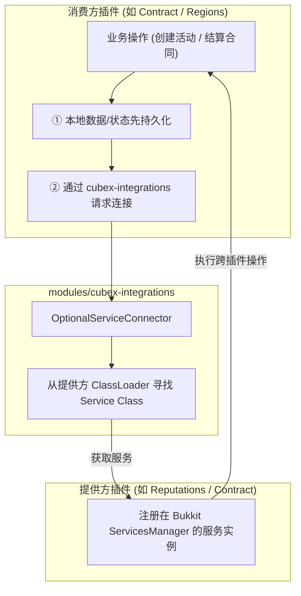

# CubeX-Plugins · 体系架构设计

> **状态**：现行基线（2026-08 锁定）  
> **定位**：阐述 CubeX 插件生态的设计哲学、构建治理、隔离边界与跨插件连接模型。  
> **相关文档**：共享模块使用指南见 [`MODULES.md`](MODULES.md)，演进计划与待办见 [`PLAN.md`](PLAN.md)，协作约束看 [`AGENTS.md`](AGENTS.md)。

---

## 1. 设计哲学与核心硬约束

CubeX 是面向大型 Minecraft 服务器网络的插件生态，由多款业务插件与一套共享基础设施构成。

### 1.1 核心铁律

1. **单插件独立可安装（Zero-Hard-Dependency）**
   - 每一个业务插件 jar 必须能够**单独安装并在无其他 CubeX 插件的环境下完整正常运行**。
   - 严禁在插件之间引入 Gradle `implementation` 或 `compileOnly` 编译期硬依赖。
   - 严禁将另一个插件的 API 或实体类 shade 打包到自身 jar 中。
2. **有状态 vs 无状态的边界划分**
   - **无状态共享代码** $\rightarrow$ 下沉至 `modules/cubex-*`，由构建工具按需 `shade` 进各插件独立 jar 中（各插件在独立 ClassLoader 下隔离运行各自的代码副本）。
   - **有状态的跨插件共享服务** $\rightarrow$ 做成**独立插件**（单实例运行，如 [`Reputations`](Reputations) 负责全服信誉聚合存储）。严禁将有状态服务做成共享模块，否则各插件各自持有一份隔离数据，导致状态割裂。
3. **标准参考实现（Reference Implementation）**
   - [`Contract`](Contract) 是全仓接入 `modules/cubex-*` 的唯一参考实现。编写新插件或重构现有插件时，生命周期编排、资源管理、重载链、I18n 与 GUI 模式均以 Contract 为基准对齐。

---

## 2. 仓库架构与构建治理

全仓采用 **Gradle Monorepo + `buildSrc` 约定插件** 的统一治理架构：

```
CubeX-Plugins/
├── buildSrc/                          # 中央构建治理与约定插件
│   └── src/main/kotlin/
│       ├── CubexRelocations.kt        # 自动化包重定位规则
│       └── ...
├── modules/                           # 共享基础设施模块（按需 shade）
│   ├── cubex-core                     # 生命周期契约、Terminable 资源栈、日志、文本、命令补全
│   ├── cubex-config                   # YAML 处理、版本化配置迁移框架、ReloadChain
│   ├── cubex-i18n                     # I18n 多语言服务（MiniMessage / Legacy / Fallback）
│   ├── cubex-scheduler                # 跨平台调度器抽象（Paper / Folia / Spigot）
│   ├── cubex-integrations             # 无状态 ClassLoader 反射服务连接器
│   ├── cubex-database                 # SQLite 连接工厂、PRAGMA 安全配置、事务模板
│   ├── cubex-command                  # CommandMap 动态命令注册与注销
│   ├── cubex-gui                      # 事件驱动 GUI 框架、安全 ItemBuilder、通用 Pagination
│   └── cubex-spatial                  # 3D 空间索引（Point3D / Range3D / Octree 八叉树）
└── [Plugin-Subprojects]/              # 12 个独立业务插件
    ├── BookLite / FAWEReplacer / MountLicense / Contract / EcoBalancer / RuleGems
    └── Metro / Railway / Clarity / Reputations / Regions / StateCharge
```

### 2.1 依赖与字节码隔离规范
- **Kotlin 运行时重定位**：`buildSrc` 约定插件强制将所有 shade 进插件 jar 的 Kotlin 标准库、共享模块及第三方依赖进行 namespace 重定位（Relocation），确保与服务器环境或其他插件的依赖完全隔离。
- **发布门禁（`jarGate`）**：构建流水线中包含字节码与 jar 结构门禁，自动化校验未重定位的 Kotlin 泄露（强制 `unrelocatedKotlin=0`）、无害附魔兼容性与各插件字节码 Target。
- **Java 目标版本**：
  - 全仓统一编译目标为 **Java 17**。
  - **唯一例外**：[`Clarity`](Clarity) 使用 1.21 新属性系统 API，编译目标固定为 **Java 21**。

---

## 3. 跨插件连接模型（Optional Integrations）

当两个 CubeX 插件同时装服时，它们可以通过可选接口产生联动，但绝不破坏“单独可安装”原则。



### 3.1 跨类加载器连接机制（`OptionalServiceConnector`）
Bukkit 为每个插件分配了独立的 `ClassLoader`。如果两个插件各自 shade 相同的接口类，在 JVM 中会产生不同的 `Class<?>` 标识，导致 `ServicesManager.load` 匹配失败。  
`cubex-integrations` 的解决方案：
1. 运行时按插件名查找提供方插件实例；
2. 直接从**提供方插件的 `ClassLoader`** 中动态反射加载 Service 接口类；
3. 从 `ServicesManager` 获取注册的服务实例并执行调用；
4. **不长期缓存连接**，在服务器 reload 或插件卸载时天然具备容灾能力。

### 3.2 两种连接语义
1. **最佳努力增量镜像（Best-effort Delta Mirror，如 Contract $\rightarrow$ Reputations）**：
   - 消费方优先提交本地事务（写本地 YAML/SQLite）；
   - 跨插件连接失败或提供方缺失时**仅记录日志、优雅降级**，绝不中断或回滚本地流程；
   - 重连在下一次调用时按需发生，不重放历史数据以防重复计数。
2. **强一致幂等托管（Transactional Escrow，如 Regions $\leftrightarrow$ Contract WAGER）**：
   - 涉及真实经济资金或物品流动，必须采用**幂等领域 API**；
   - 双方必须使用全局唯一的持久化 `operation_id`（记录在 `reward-funding.yml` 或事件日志中）；
   - 支持跨重启/重载时重放 `lock` / `settle` / `refund`；
   - 若出现部分付款或状态不明确，立即标记为 `REVIEW_REQUIRED` 转人工复核，严禁产生二次结算。

---

## 4. 关键架构锁定决议（不可随意推翻）

1. **Railway 与 Metro 的同名同包保留**：
   - [`Railway`](Railway) 的源码包名即为 `org.cubexmc.metro`，主类同名。
   - **决策原因**：Railway 为适配独特发车与物理调度而演化，但仍需从 Metro 同步最新线路控制算法。两插件本身在玩法上**互斥、不支持同时安装**。
2. **Reputations 保留 Java 公开 API 面**：
   - [`Reputations`](Reputations) 下的 `org.cubexmc.reputations.api`（3 个文件）是有意保留的 Java 接口，为第三方与 JVM 生态提供最稳定的兼容面，**不要为了迁移计数将其迁为 Kotlin**。
3. **配置迁移必须单向受控**：
   - 各插件配置文件由 `cubex-config` 的 `MigrationRunner` 托管。版本升级必须显式编写迁移步骤，执行前自动生成 `.bak` 备份，失败时必须触发原子回滚并拒绝破坏用户既有配置。
