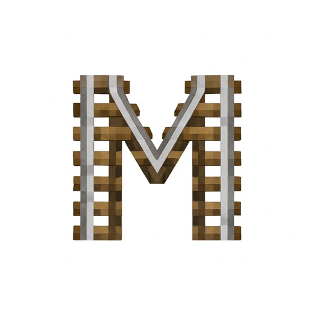

  
  <h1>Metro Subway System</h1>
  
A Minecraft subway transit plugin

  

    
    
    
    
    
    
    
    
  

  

    <a href="README.md">中文</a>
    ·
    <a href="https://github.com/CubeX-MC/Metro/wiki">Wiki</a>
    ·
    <a href="https://discord.com/invite/7tJeSZPZgv">Discord</a>
    ·
    <a href="https://pd.qq.com/s/1n3hpe4e7?b=9">QQ</a>
    ·
    <a href="https://modrinth.com/plugin/metro">Modrinth</a>
  

Metro is a Minecraft subway transit plugin. Administrators can create automated subway networks. Players can right-click a powered rail to summon a minecart and ride automatically.

Supports Paper 1.18+ and Folia.

Run `/m` or `/metro` to open the management GUI directly. Use `/m help` for command help.

## Features

- **Multi-line Network** — Create multiple routes with stops and transfers
- **GUI Administration** — Built-in GUI management
- **Pricing System** — Flat, distance-based, and interval-based fares; mid-route exits are billed through to the next station by default (`economy.mid_route_exit_fare`)
- **Permission System** — Per-element trust and ownership
- **Safe Mode** — Protect minecarts from pushing, attacks, and destruction
- **Minecart Portals** — Cross-area and cross-world teleportation
- **Web Map** — BlueMap / Dynmap / Squaremap integration
- **Economy** — Optional Vault support; fares from lines without an owner can be paid into the account named by `economy.account` (empty = destroyed, the old behaviour)
- **Multi-language** — Chinese, English, German, Spanish, and more
- **Folia Support** — Compatible with Folia multithreaded servers

After selecting the area, stand on the powered rail inside it and face the departure direction. `/m stop create central Central Station` saves both corners, the centered stop point and launch direction together. The name defaults to the ID. Without a powered rail beneath the player inside the selection, only the area is created and Metro explains how to finish with `/m stop setpoint`.

`/m line create main` accepts an omitted display name. Inside a unique stop, `/m line addstop main` appends that stop. `/m stop setcorners` applies a new selection to the current stop, and `/m stop setpoint` uses your position and facing. Overlapping stops require an explicit ID; permissions and ownership still apply. Portal creation and destination commands retain their existing position-based behavior.

Waiting Titles honor `interval`, `fade_in`, `stay` and `fade_out`; title, subtitle and actionbar all support `<countdown>` / `{countdown}`, including custom stop templates. Departure displays once; the unused legacy `titles.departure.interval` can be removed. Arrival and terminal displays support `actionbar`; disabling arrival Titles does not mute arrival sounds. Optional `titles.stop_continuous.multi_line.title/subtitle/actionbar` templates support `{count}` and `{routes}`, with localized defaults when absent. `always: false` displays on every re-entry. Re-enter the area after editing station templates to see the changes.

Language files migrate to v4 with contextual feedback in all seven languages and updated optional-argument help, preserving other custom translations.
## Basic Concepts

| Concept | Description |
| :--- | :--- |
| **Line** | An ordered list of stops that defines a train route |
| **Stop** | A station area defined by two corner points |
| **StopPoint** | A powered rail where players board |
| **Transfer** | Connections from one Stop to other Lines |

## Configuration

Line `max_speed` and `settings.cart_speed` use blocks per tick. Metro detects **Minecart Improvements** in each world and uses native experimental movement, with early station braking and dock drift correction. It does not enable world experiments or change game rules. See [experimental minecart physics](docs/minecart-improvements.md) for setup and verification boundaries. Paper 26.1.2 requires Java 25; Metro retains Java 17 bytecode.

`speed_control.cruise_control` has been removed. Configuration migrates to v5 with an automatic backup; safe-mode stall recovery remains available.

## Learn More

Full documentation is available on the [Metro Wiki](https://github.com/CubeX-MC/Metro/wiki).

---

 
