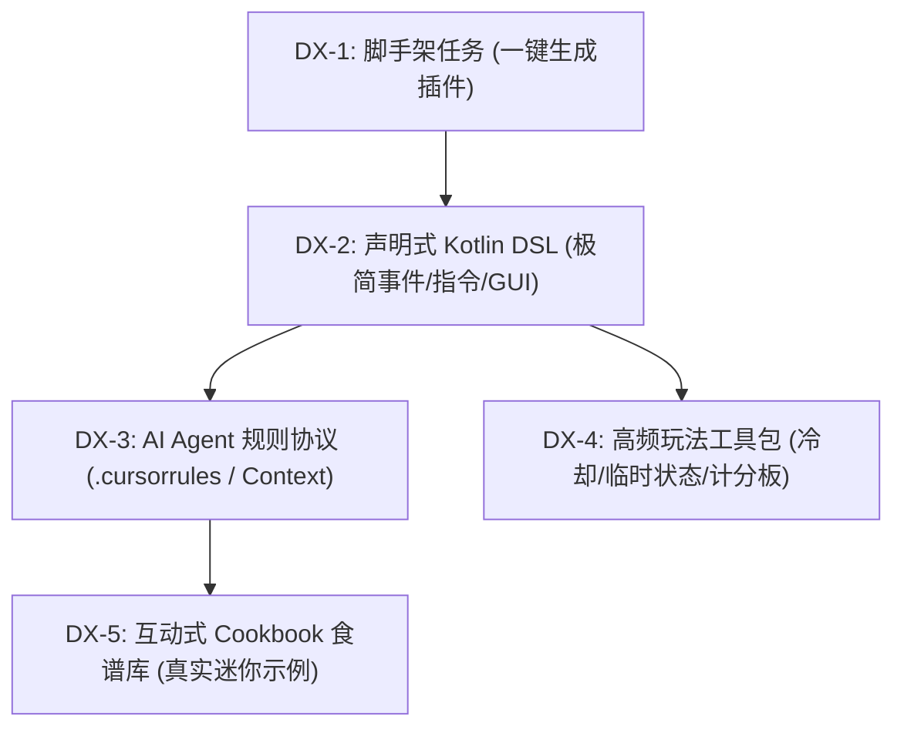

# CubeX-Plugins · 统一计划

> **本文件是全仓唯一的计划/进度记录。** 2026-08-17 由 13 份分散的计划文件合并而来；
> 原始全文保留在 git 历史（合并前最后一次提交 `2783844`）。
>
> 分工：约定与硬约束看 [`AGENTS.md`](AGENTS.md)，构建看 [`README.md`](README.md)，
> 架构依据看各 `CUBEX_*_DESIGN.md` / [`ARCHITECTURE_PROPOSAL.md`](ARCHITECTURE_PROPOSAL.md)，
> 发布记录看各插件 `CHANGELOG.md`。**新的待办只写进本文件**。

---

## 1. 仓库现状速览

| 维度 | 现状 |
|---|---|
| 插件数 | 12 个可独立安装：BookLite · FAWEReplacer · MountLicense · Contract · EcoBalancer · RuleGems · Metro · Railway · Clarity · Reputations · Regions · StateCharge |
| 共享模块 | **9 个**：`cubex-core` · `cubex-config` · `cubex-i18n` · `cubex-scheduler` · `cubex-integrations` · `cubex-database` · `cubex-command` · `cubex-gui` · `cubex-spatial` |
| Kotlin 化 | ✅ 2026-08-16 收口。全部插件与模块 opt-in Kotlin 并继承 `CubexPlugin` |
| 字节码目标 | 全仓 Java 17；**Clarity 例外为 21**（1.21 属性 API）。`jarGate` 按各插件 release 分别校验 |
| 已发布/待发布 | 已公开：BookLite · MountLicense · Metro · Railway · RuleGems · EcoBalancer · FAWEReplacer。未公开首发：Contract · Regions · StateCharge · Clarity · Reputations |
| 全仓验收 | `gradlew build jarGateAll` 全绿（12 插件 + 9 模块） |

遗留 `.java` 仅：vendored bStats `Metrics.java`、Reputations 的公开 Java API
（`org.cubexmc.reputations.api`，3 个文件，**故意保留**）、Metro/Railway 的互操作 shim。
**不要为文件计数迁掉它们。**

---

## 2. `modules/` 已支持的能力（按源码核对，2026-08-17）

### 2.1 `cubex-core` — 必选，12/12 插件接入

| 类型 | 能力 |
|---|---|
| `CubexPlugin` | `onEnable`/`onDisable` 为 `final`；业务写在 `enablePlugin()`/`disablePlugin()`。enable 抛异常 → 记 SEVERE + 自禁用；`abortEnable(reason)` → 记 WARNING + 自禁用（依赖缺失等**非错误**中止，如 Contract/StateCharge 缺 Vault）。disable 时先跑 `disablePlugin()`，再 LIFO 关闭全部 `bind(...)` 资源，单个失败不中断其余 |
| | `registerListener` · `registerCommand`（`plugin.yml` 缺声明时记 SEVERE 返回 false，不静默） · `saveResourcesIfMissing(vararg)` · `bindTask(handle, canceller)` |
| | `log()` / `messager()` / `text()` 均为 public |
| 资源栈 | `Terminable`(fun interface, `of(Runnable)`) · `TerminableConsumer` · `TerminableRegistry`（LIFO + `CloseFailureHandler`） |
| 契约接口 | `Reloadable` · `TaskCanceller`（均为 fun interface） |
| `CubexLogger` | `info/warn/severe/debug/log`，带/不带 `Throwable` |
| `CubexText` | `color`(null→"") · `colorOrNull` · `stripControl` · `nullToEmpty`；legacy `&` + `&#RRGGBB`，**零第三方依赖** |
| `Messager` | `send` / `sendLines` |
| `CubexCommandSuggestions` | `root(args, candidates)` 归一化 Paper `BasicCommand` 空数组与 Bukkit `arrayOf("")`；`matching` 大小写无关前缀过滤 |

### 2.2 `cubex-config` — 10/12

`ResourceFiles`（saveIfMissing/dataFile/exists）· `YamlFiles`（loadDataFile/loadResource/loadResourceUtf8）·
`YamlDefaults.mergeResourceIntoDataFile` + `DefaultMergeOptions`/`DefaultMergeResult` ·
**版本化迁移框架**（`MigrationPlan` + `MigrationRunner` + `MigrationStep`/`MigrationContext` →
`MigrationReport`，含备份、`MigrationFailurePolicy`、保存失败回滚）·
`LegacyTextToMiniMessageStep`（`AngleBrackets.PRESERVE`）·
`ReloadChain`（`ReloadFailurePolicy`/`addIf`/`ReloadReport`）· `ConfigReload.bukkitConfig`。

`ReloadChain` 目前只有 **Contract · Regions · StateCharge** 3 家使用 → 见 §5.4。

### 2.3 `cubex-i18n` — 10/12

`I18nService`：`raw`/`rawOrNull`/`rawList` · `message`(map/位置参数/指定 locale) · `messageList` ·
`component`/`componentList`/`componentOf` · `send`；本身实现 `Reloadable`。
`I18nOptions` 覆盖语言目录、locale（值或 `Supplier`）、fallback 链、bundled locales、
`prefixKey`/`prefixToken`/`keyPrefix`、`MissingKeyMode`、`colorize`、`ColorMode`、`PlaceholderStyle`。
`ColorMode` = `LEGACY_AND_HEX` / **`MINIMESSAGE`（已实现）**；
`PlaceholderStyle` = `%n%` / `{n}` / `%1` / `<n>`(MiniMessage tag)。

> **设计文档已过期**：`CUBEX_CONFIG_I18N_DESIGN.md` §7 的"阶段 A/B 逐插件现代化"**已经走完**。
> 12 个 `LanguageManager` 全部引用 `ColorMode.MINIMESSAGE`，10 个插件用 `MigrationRunner`。
> 以本节为准，不要再把它当待办。

### 2.4 `cubex-scheduler` — 7/12

平台探测（`isFolia`/`isPaper`/`isSpigot`）· 全局/异步/实体域/区域域 × 立即/延迟/定时 ·
`teleportAsync` · `cancelAll` · `bindTo(CubexPlugin)` · `CubexTask : Terminable` ·
`ManagedCubexTask`（任务体内自取消的竞态）· `LegacySchedulerAdapter` 兼容层。
FoliaLib 不向插件泄漏原 API。

### 2.5 `cubex-integrations` — 2/12（Contract · Regions）

`OptionalServiceConnector.connect(descriptor)` → `Connected` / `Unavailable(reason)`，
`ServiceUnavailableReason` 覆盖 `PLUGIN_MISSING`/`PLUGIN_DISABLED`/`API_CLASS_MISSING`/
`SERVICE_NOT_REGISTERED`/`SERVICE_TYPE_MISMATCH`。
从**提供方 ClassLoader** 加载 API class 再查 `ServicesManager`；**故意不缓存连接**；无状态。
**改动前先读 `CUBEX_INTEGRATIONS_DESIGN.md`。**

### 2.6 `cubex-database` — 3/12（BookLite · EcoBalancer · RuleGems）· 2026-08-17 新建

| 类型 | 能力 |
|---|---|
| `SQLitePragmas` | builder：`busyTimeoutMillis`/`wal`/`synchronous`/`foreignKeys`/`tempStoreMemory`/`cacheSizeKb`。**未设置的 pragma 不发语句**，保留 SQLite 默认而不是替服主猜 |
| `SQLiteDatabase` | 路径解析（相对→dataFolder，绝对→原样）· `openConnection()` 加载驱动 + 套 PRAGMA · `ensureParentDirectory()` · `jdbcUrl()` |
| | 两个兼容开关，用来保住各插件**原有**行为：`mirrorBusyTimeoutInUrl`（仅 EcoBalancer 开，它本来就把 busy_timeout 写进 URL）、`ignorePragmaFailures`（仅 EcoBalancer 开，它本来就吞掉 PRAGMA 失败）。默认都为关 |
| `JdbcOps` | `withConnection` · `inTransaction`（成功 commit / 失败 rollback，并还原 autoCommit） |

**不纳入（设计已锁定，别加）**：HikariCP、DAO、schema、迁移、事务重试。
`sqlite-jdbc` 在模块里是 `compileOnly` —— 各插件已各自打包且**绝不 relocate**，模块不能再塞一份。

### 2.7 `cubex-command` — 2/12（FAWEReplacer · RuleGems）· 2026-08-17 新建

| 类型 | 能力 |
|---|---|
| `CommandMaps` | `resolve(server)`：Paper `Bukkit.getCommandMap()` → CraftServer `commandMap` 反射兜底 · `knownCommands(map)` 取活 map（RuleGems 覆盖别人已占标签时要用） · `unregister(map, command)` **按身份**移除本命令及其别名 |
| `CommandRegistrar` | `registerPluginCommand`（`MissingCommandPolicy.WARN`/`THROW`，executor 同时是 `TabCompleter` 就一并注册） · `registerDynamicCommand` 返回 `Terminable`，可绑进 `CubexPlugin` 资源栈，disable 时自动撤销；可注入已缓存的 `CommandMap` |

**不纳入**：命令 DSL、Cloud annotations 封装、子命令路由模型。

> 接入时顺手修掉一个潜在 bug：RuleGems 原来按**名字**删 `knownCommands`，
> 若某标签被别的插件抢先注册，卸载时会把对方的条目一起删掉。
> `CommandMaps.unregister` 改为**按对象身份**匹配，只删真正属于自己的条目。

### 2.8 `cubex-gui` — 3/12（Contract · Metro · Railway）· 2026-08-17 新建

| 类型 | 能力 |
|---|---|
| `InventoryButton` · `Menu` · `MenuRegistry` | 由 Contract 的 `gui/framework/` 原样上移。按 Inventory 实例路由 click/close/drag/quit（取代"标题匹配 + 中央 `when(slot)` 分发"），`openMenu(playerId)`/`closeAll()` |
| `ItemBuilder` | `name`/`amount`/`lore`/`addLore`/`addEmptyLore`/`enchant`/`glow`/`flags`/`hideAttributes`/`customModelData`/`skullOwner`/`data`(String·Int PDC)/`guiMarker`/`build`。合并了 Metro、Railway、RuleGems 三份各自的实现 |
| `TextStyler` | 显示文本如何着色是**显式参数**：Metro/Railway 传 `&` 串走自己的 `ColorUtil`，走 `cubex-i18n` 的插件传已渲染文本用 `TextStyler.NONE`。传错会二次处理或漏出原始代码，所以不给"聪明"的默认推断 |
| `Pagination` | 纯页码算术，**不依赖 Bukkit**（GUI 与聊天分页共用）：`pageCount`/`clamp`/`hasPrevious`/`hasNext`/`firstIndex`/`lastIndexExclusive`/`countOn`/`slice`。1-based（与现有全部 `/… list <页码>` 一致）；空列表算 1 页空页；越界 clamp 不抛；`slice` 在"声明总数 > 实际取到行数"时不会越界 |

两个实现细节是有意的，别"顺手改"：
- `glow()` 的无害附魔常量在目标版本间改过名（1.18 `DURABILITY` → 1.21 `UNBREAKING`），
  因此**反射解析**；解析不到就不加附魔，而不是让整个物品构造失败。
- 没设过 lore 时**不写** lore 列表——写空列表会在名字底下多出一行空白。

Metro/Railway 各自保留同名 `org.cubexmc.metro.gui.ItemBuilder` 作为**薄适配器**
（只绑定自己的 `ColorUtil` 与 GUI 标记 key），因此 90 多个调用点一行没动；
构造逻辑本身已经在模块里。Metro 的 `guiMarker` 是它独有的增强，Railway 未移植，**维持现状**。

### 2.9 `cubex-spatial` — 2/12（Metro · Railway）· 2026-08-17 新建

`Point3D`（含 `Location` 构造）· `Range3D`（AABB：`contains`/`intersects`/`subdivide`/equals/hashCode）·
`Octree<T>`（读写锁 + 深度/容量分裂：`insert`/`remove`/`firstRange`/`getAllRanges`/`clear`）。
抽取前已核对 Metro 与 Railway 两侧内容**逐字节一致**（仅换行符不同）。
按既定纪律**只下沉无状态空间索引**，`StopManager`/`Stop` 留在插件内。

### 2.10 模块接入矩阵

| 插件 | core | config | i18n | scheduler | integrations | database | command | gui | spatial |
|---|:--:|:--:|:--:|:--:|:--:|:--:|:--:|:--:|:--:|
| BookLite | ✅ | ✅ | ✅ | — | — | ✅ | — | — | — |
| FAWEReplacer | ✅ | ✅ | ✅ | — | — | — | ✅ | — | — |
| MountLicense | ✅ | ✅ | ✅ | — | — | — | — | — | — |
| Contract | ✅ | ✅ | ✅ | ✅ | ✅ | — | — | ✅ | — |
| EcoBalancer | ✅ | ✅ | ✅ | ✅ | — | ✅ | — | — | — |
| RuleGems | ✅ | ✅ | ✅ | ✅ | — | ✅ | ✅ | — | — |
| Metro | ✅ | ✅ | ✅ | ✅ | — | — | — | ✅ | ✅ |
| Railway | ✅ | ✅ | ✅ | ✅ | — | — | — | ✅ | ✅ |
| Regions | ✅ | ✅ | ✅ | ✅ | ✅ | — | — | — | — |
| StateCharge | ✅ | ✅ | ✅ | ✅ | — | — | — | — | — |
| Clarity | ✅ | — | — | — | — | — | — | — | — |
| Reputations | ✅ | — | — | — | — | — | — | — | — |

---

## 3. 模块层：计划已全部完成 ✅

`CUBEX_CORE_DESIGN.md` §2/§3 与原 `ROADMAP.md` §4 列出的候选模块**已全部落地并接入真实使用方**
（2026-08-17）。没有剩余的模块层计划。

| 模块 | 出处 | 落地方式 |
|---|---|---|
| `cubex-database` | `CUBEX_CORE_DESIGN.md` §2.4/§3.4 | 新建，接入 BookLite/EcoBalancer/RuleGems 三家 |
| `cubex-command` | `CUBEX_CORE_DESIGN.md` §2.5/§3.5 | 新建，接入 FAWEReplacer/RuleGems |
| `cubex-gui` | 原 `ROADMAP.md` §4 | 从 Contract `gui/framework/` 上移 |
| `cubex-spatial` | 原 `ROADMAP.md` §4（2026-08-02 审计） | 从 Metro/Railway 上移，两侧同时切换 |

### 3.1 与 NewNanCity 的对标复审（2026-08-17）

参照 `reference/NewNanCity-Plugins` 做过一轮能力对比。两边地基一致（Gradle + buildSrc 约定插件 +
monorepo + shade 进各 jar + Terminable 资源栈 + BasePlugin 生命周期模板），差异在投入方向。

**已按实测重复吸收的**：`ItemBuilder` 与 `Pagination`（见 §2.8）。
判据是实测调用点，不是"他们有所以我们也要有"：

| 能力 | 实测重复 | 结论 |
|---|---|---|
| 页码算术 | `max(1, ceil(n/size))` 在 Contract ×2、EcoBalancer ×2、Metro ×6、Railway ×5 出现，另有 `EcoBalancer/PageUtils` | ✅ 抽取 |
| ItemStack 构造 | Metro / Railway / RuleGems **三份独立 `ItemBuilder`**，另有 ~8 处直接操作 `ItemMeta` | ✅ 抽取 |

**明确不吸收的**（复审已否，不要再提，除非重复度变了）：

| 他们有的能力 | 我们的实测情况 | 不做的理由 |
|---|---|---|
| `MinecraftVersion` 版本探测 | 只有 `Metro/VersionUtil` 与 `Railway/VersionUtil`——**同源同一份代码，实际 1 个使用方** | 不满足"两个真实使用方" |
| `SkullUtils` 独立工具 | 只有 RuleGems 用头颅，**1 个使用方** | 已作为 `ItemBuilder.skullOwner` 顺带覆盖，不单开工具类 |
| 事件订阅 DSL（`EventFilters` 等） | 各插件用裸 Bukkit Listener，**没有实测痛点** | 纯投机抽象；`CubexPlugin.registerListener` 已覆盖注册样板 |
| `BaseModule` 插件内模块树 | 我们的插件在 `enablePlugin()` 里手写编排，暂未出现编排失控 | 收益未证实；真需要时应由 Contract/Regions 的实际疼痛驱动，而不是先建框架 |
| 日志 provider / formatter / `PerformanceMonitor` | 各插件用 `CubexLogger` 够用；EcoBalancer 的文件 logger 是业务特性 | `CUBEX_CORE_DESIGN.md` §5.1 已定：不让 core logger 吃掉业务日志特性 |
| Jackson 多格式配置 | 全仓已统一 Bukkit YAML + 版本化迁移框架，10 个插件在用 | 换掉会推翻所有现有配置文件与刚落地的迁移链，代价远超收益 |

**顺带记录两点他们的做法我们不采纳**：他们的约定插件里 `tasks.withType<Test> { enabled = false }`
（测试从不运行）；他们只 relocate `org.jetbrains.kotlin` 与 `kotlin.reflect`，不 relocate `kotlin.*`
stdlib。我们的 `jarGate` 强制 `unrelocatedKotlin=0` 且测试随每次构建运行，**保持现状**。

**继续维持的铁律**：有状态的共享服务 = **独立插件**（单实例持数据，如 Reputations）；
无状态的共享代码 = **shade 进各 jar 的模块**。把有状态服务做成 shade 模块会让各插件各持一份、互不共享。
新模块要加进 `settings.gradle.kts`；新**插件**才需要加进 `CubexRelocations.kt` 的 pluginIds。

后续若再要新模块，先满足两个条件再动手：**(a) 至少两个真实使用方**，
**(b) 抽取提交只做搬迁、先让一个插件切过去并过 `shadowJar`/`jarGate`，再推广另一侧。**

---

## 4. 跨插件路线（2026-08-17 复审，已剪掉不成立的条目）

复审标准：**有没有真实使用方**、**是否与"插件互不依赖"的硬约束冲突**、
**是否只是换皮**。下面标 ❌ 的是本次**移除**的条目，不要再捡回来。

### R1 — Regions ↔ Contract WAGER 托管 · 唯一高优先级项

第一阶段已完成：Contract 暴露窄接口 `ContractEscrowService`；`dual_pvp`/`union_war` 可配
`reward-source: contract`；Regions 用 `reward-funding.yml` 存 lease，重启/reload 以**同一 operation id**
重放 lock/settle/refund，部分付款或状态不明 → `REVIEW_REQUIRED` 人工复核，绝不二次付款。

- [ ] **真实 Paper/Folia + Vault 双插件故障注入验证** — 这是全仓剩余项里价值最高的一条：
      它是"真钱跨插件流动 + 重启重放"唯一还没有实服证据的环节。
      场景至少覆盖：settle 中途关服、Vault provider 中途卸载、Contract 先于 Regions 卸载、
      同一 operation id 重复提交、`REVIEW_REQUIRED` 后的人工处理路径。
- ❌ ~~race / hide-and-seek / 赞助 / 多人分成的结果语义~~ —— 不是独立条目。
      这些 Mode 在 Regions 侧本身还没做完，语义要和 §5.2 阶段 D 一起定，单列只会造成两处漂移。

### R2 — EcoBalancer 基于自定义事件的税收（未开工，保留）

让税收不止"定时/交易"，而可挂在**自定义游戏事件**上（示例：`keepInventory` 生效时的死亡税）。
需要**可扩展的"触发器 → 税目"框架**：事件源 + 条件 + 税率/税额 + 去向（销毁/系统/国库），
服主可配置可增删，**而非硬编码每一种税**。

保留理由：这是本轮复审里**唯一新增玩家可见价值**的跨插件项，且已有天然落点——
`TaxRunService` 的执行生命周期（账本、PAPI、进度状态都已挂在那里）。

### R3 — Reputations 完善（大幅收窄）

Reputations 目前**只有 Contract 一个消费方**，且尚未公开发布。在第二个字段提供方出现前，
按"可扩展性"预建抽象正是各设计文档反复警告的投机性设计。

保留：
- [ ] 排行榜 + 信誉变动事件广播 + PlaceholderAPI 占位符（玩家/服主直接可见，单消费方即可验证）

移除：
- ❌ ~~外部属性 provider SPI + 软依赖适配器（Lands 国家/领袖）~~ —— 没有第二个提供方，
      SPI 的形状只能靠猜；等真有 Lands 接入需求时再按当时的真实数据定。
- ❌ ~~衍生评分/等级(tier) 与加权聚合~~ —— 权重口径本身就是未定的玩法决策
      （原文档已记录"改分公平性顾虑"），先做只会做错。
- ❌ ~~历史数据幂等导入工具~~（原 R0 待办）—— Contract 展示读的是**自己的**
      `reputation.yml`，玩家看到的数字已经正确；聚合服务目前没有第二个消费方去读那段历史。
      等真有跨插件消费方时再做，届时才知道要导成什么形状。

### R0 — Contract ↔ Reputations（第一阶段完成，剩余项已清空）

已完成：Contract 经 `cubex-integrations` 注册 `Contract:completed/cancelled/expired/disputed`
并把**新增量** best-effort 镜像过去；Reputations 缺席/禁用/不兼容时 Contract 完整独立运行。

- ❌ ~~让展示优先读聚合服务~~ —— **与硬约束直接冲突**：那会让 Contract 的展示依赖
      Reputations 是否在线，而"每个插件必须能单独安装、缺席时完整运行"是不可让步的边界。
      本条不是"以后再做"，是**不做**。

### R4 — 统一指令格式（收窄为"新增代码遵守 + 文档化"）

现状：根补全的形态差异已由 `CubexCommandSuggestions` 统一；动态命令注册/撤销已由
`cubex-command` 统一。剩下的是权限命名、`help`/`usage` 渲染、提示与颜色规范。

- [ ] 写一份命令/权限规范（`<plugin>.<area>.<action>`、help 渲染、错误与成功提示、颜色），
      **新代码与未公开插件（Contract/Regions/StateCharge/Clarity/Reputations）遵守**
- ❌ ~~回头重命名已公开插件的权限节点~~ —— 已公开的 7 个插件的权限节点是服主
      配置文件里的公共契约，批量重命名会**静默破坏线上权限组**，代价远超收益。
      要改只能随大版本 + 提供旧节点兼容期，不作为常规待办。

---

## 5. 各插件待办

### 5.1 Contract（未公开首发）

资金核心、WAGER、PARTNERSHIP、GUI 大厅化（铁砧已彻底移除）、Reputations 桥、
Regions escrow API、bStats 均已完成。

#### 合同类型审计（2026-08-17）：7 种能否由 3 种原始类型表达

已实现的三种原始类型：**SERVICE**（单边押注 + 开放接单 + `OWNER_APPROVE`）、
**WAGER**（双边押注 + 具名对手 + `ARBITER`）、**PARTNERSHIP**（双边押注 + `BOTH_APPROVE`）。

| 类型 | 结论 | 依据 |
|---|---|---|
| **BOUNTY** | **✅ 完全冗余，已删除** | `SERVICE` + `ResolutionRule.SYSTEM_OBJECTIVE` + `ContractObjective`（18 种 `ObjectiveType`，含 `KILL_PLAYER`/`KILL_ENTITY`）**已经实现**了"第一个完成 X 的人自动结算"，`ContractService` 里有 `SYSTEM_OBJECTIVE_COMPLETED` 结算路径。单独加 BOUNTY 只是把 OWNER/CONTRACTOR 改名成 POSTER/CLAIMER |
| **SALE** | **✅ 可由 PARTNERSHIP 表达**，不需要新机制 | 形状与 PARTNERSHIP 完全一致（双方押注 + `BOTH_APPROVE`），差别只在**交换**而非各退各。`PayoutRule(SUCCESS, source=PARTY_A, recipient=participant(PARTY_B), 100%)` + 反向一条即可表达。**唯一缺口是 ITEM 资产**（见下） |
| **ALLIANCE** | ❌ **不可归约** | 现有类型都是 1-2 方。需要 (a) 多方接受状态 `PENDING_ACCEPT_MULTI`；(b) `PayoutRule.source` 只能指一个 `ParticipantRole`，N 个 ALLY 共用一个角色时无法表达"违约者押注按 N-1 等分给其他人" |
| **LOAN** | ❌ **不可归约** | 需要 **initial-transfer**：创建时钱**直接转给** debtor 而非进托管。现有全部类型都是"押注进托管"，没有任何一条路径让资金在结算前离开托管。另需还款动作与到期自动判决 |

**落地结论**
- [x] 删除 `ContractType.BOUNTY`、`ResolutionRule.EVENT`、`ParticipantRole.POSTER/CLAIMER`
      及其语言键；顺手修好 `templates.yml` 的 `preset_bounty`——它本来就写着
      `objective-type: KILL_PLAYER`，却挂在没有创建路径的 `BOUNTY` 类型上（**等于一个发不出去的预设**），
      现改为 `type: SERVICE`，玩法不变
- [ ] **SALE**：加 `Contract.createSale(...)`（PARTNERSHIP 形状 + 交换 payout 规则）。ITEM 资产已就绪，可以开工
- [ ] **ALLIANCE**：`createAlliance` + `PENDING_ACCEPT_MULTI` + **动态生成 payouts**
      （已定方案 B：违约时按当时状态构造规则；不采用方案 A 加 `SourceSelector`，避免模型膨胀）
- [ ] **LOAN**：initial-transfer + 可选抵押物 + 到期自动判决（还款成功退抵押物 / 失败给 creditor）
- [ ] **RECURRING 租赁**：推到最后。已定方案——不在 Contract 内加 schedule 字段，改为"父合同生成子合同"
- [ ] **PARTNERSHIP 共享池**（sharedPool）未实现

#### ITEM 资产（2026-08-17 完成）

审计发现原计划描述已过期：**真正的物品托管早就实现了**——`Contract.deliveryItems`/`rewardItems`
持有真实 `ItemStack`，由 `ContractStorage` 以 `ItemStack.serialize()/deserialize()` 持久化，
GUI 有完整领取流程。过期的是 `Asset`：`Asset.item()` 只存 `"DIAMOND x 64"` 这样的**展示字符串**，
与真实托管**各存一份、可能对不上**。

- [x] `Asset` 的 ITEM 改为携带真实 `ItemStack`（`Asset.item(stack)`、`itemStack()`、`itemCount()`），
      `toMap`/`fromMap` 走 `ItemStack.serialize()` 往返，并**同时保留** `reference` 展示串
- [x] 旧存档兼容：只有 `reference` 没有 `item` 的记录照常加载（不臆造 stack）；
      `item` 载荷损坏时退回展示串而不是让整份合同加载失败
- [x] `Participant.itemStake()` / `itemStakeAmount()`；`AssetTest` 覆盖新旧两种格式与损坏载荷
- [ ] 让 `deliveryItems`/`rewardItems` 与参与者 stake 共用同一份数据（现在是"同源写两处"，
      已不再会不一致，但仍是两份状态）——重构项，不阻塞玩法

#### PlaceholderAPI（2026-08-17 完成）

- [x] `ContractPlaceholderExpansion`（identifier `contracts`）：`open_count`、`total_count`、
      `my_active`、`my_pending_wager`、`my_open_posted`、`my_disputed`、`open_reward_total`。
      只读快照 + 2s 缓存（计分板每 tick 都会来问）；PlaceholderAPI 缺席/注册失败只记日志不影响启用；
      `softdepend` 加 `PlaceholderAPI`；PAPI 自带的 Adventure 被 `exclude`，避免它顶掉 paper-api 钉住的版本

#### 其他

- [ ] **声望/评价系统**（`DESIGN.md` §8.4）：合同完成后双方互评，reputation 影响
      `max-open-contracts` 上限。与 R3 一并设计，**别在 Contract 内另起一套**
- [ ] 首发前实服验证

**跨阶段不变量（底线，每阶段都必须维持）**
1. **资金状态一致** — 任何时刻 `余额 + 托管 = 之前余额`，宕机/reload 后仍成立
2. **审计完整** — 所有资金流动**先** append 到 `events.log`，**再**改 contract 状态
3. **兼容** — 引入新类型时老合同读写不破坏
4. **新类型必须有单测** — 资金分配规则、状态机转换、超时处理至少各一条

**GUI 遗留决策（动 GUI 前先看）**
- 进一步拆成 `HallGui`/`DetailGui`/`CreateFlow` 三控制器需要回指或重复代码；
  `ContractGui.kt` 现 747 行已达标（<800），**暂不强拆以免伤内聚**
- Contract 编译目标是 **paper-api 1.21.11 / 输出 release 17**，shadowJar **不 bundle/relocate Adventure**
  （由 Paper 提供）。Dialog API 仅 1.21.6+ 经 `Class.forName` 探测后启用，旧服回退 GUI+聊天。
  **代价：不再支持纯 Spigot 服**（仍支持 Paper 1.18+）
- `ChatInputService` 必须同时监听 Paper `AsyncChatEvent` 与旧 `AsyncPlayerChatEvent`

### 5.2 Regions（未公开首发）

阶段 A（授权与能力真实性）、B（模板化创作与发布）、C（运行时完整度与组合规则）代码层已收口；
Paper 1.21.11 build 132 启动/reload/关闭/端到端控制台流程已验证。

- [x] **`REAL_PLAYER_TEST.md` 真人验证已完成**（2026-08-17）：GUI 创建向导、玩家进出/死亡/断线状态清理、
      异常关服、装备托管恢复、隔离试运行、Lands/RuleGems 授权、多人 Mode 流程
- [ ] 校验器与第三方依赖的错误正文仍是英文常量，未拆成翻译键（真人验证中收集到的难懂文案先统一调整）
- [ ] 子命令升级为强类型 Brigadier 节点（当前 Lifecycle Command API + 权限过滤 + 参数补全已够用）
- [ ] 第一个公开版本发布后**冻结**数据基线（`config-version: 4`、`regions-version: 4`、
      `templates-version: 1`、`lang-version: 4`、`escrow-version: 1`）；此后任何格式变化必须提供
      从公开版本起的单向迁移 + 自动化测试
- [ ] **阶段 D — 自治活动与可信结算**：活动排期/报名/准备/开赛/结果/归档状态机；对接 Contract 托管
      支持赞助、对赌、退款、自动结算（**race/hide-and-seek/多人分成的结算语义在这里定，见 R1**）；
      记录参赛名单 + 规则 revision + 结果 + 强制操作 + 结算摘要；场地/活动/成绩/资金 placeholders
- [ ] **阶段 E — 扩展生态**：稳定的 Source/Mode/Flag/Effect/Condition/Action 注册 API；
      接入 Residence、WorldGuard 等 Source；模板导出/导入/签名/版本兼容检查。
      **新 Mode 和新 Source 不得抢在 A-C 之前扩张**
- [ ] 候选：GUI 层切到 `cubex-gui`（原计划已建议复用 Contract 的 Menu/InventoryButton 风格，现已成模块）

**明确不进入下个里程碑**：新增更多 Mode · 新 Source · 普通领主/非统治者管理 Region ·
协作者角色系统 · 模板市场与 Web 管理 · 脚本语言 · 普通统治者可发布的控制台或 OP 提权 action。

**仍生效的关键设计决策（改代码前必读）**
1. 日常管理权限**永远**是 `regions.admin`（RuleGems 统治者）**AND** 当前 Source owner，缺一不可；
   `regions.superadmin` 只用于运维与紧急接管；trusted member/租客/普通成员不能替代 owner
2. **未知或未实现能力 fail closed**——已注册字符串 ≠ 可发布；未知 Condition 不得默认通过
3. 编辑发生在草稿 revision，运行时只读**不可变的已发布** revision
4. `scale` 是 Effect 不是 Action；Action 只能通过 `effect_apply` 申请 scale lease
5. 所有临时玩家状态必须走 `ScopedEffectService`；Effect 尽量"限时 + 周期重施"降低孤儿风险
6. Flags 用 `ALLOW/DENY/PASS`，避免与 Lands 等冲突
7. Lands 与未来 guild 插件只出现在 integration/provider 层，玩法层只看 `RegionSource`/`UnionProvider`
8. `console_command` 属服务器级权力，只允许 superadmin 发布
9. 领地转让或统治者身份丢失 → **冻结并保留历史**，不自动删除，也不让旧主人继续控制
10. Region id 在 Service 层统一限制 `[a-z0-9_-]{2,48}`
11. **不要"顺手"删掉旧 `AsyncPlayerChatEvent` 监听**：只要服务器上有任何插件监听旧聊天事件
    （CMI、Contract 都会），Paper 就走 legacy 链路，`AsyncChatEvent` 一次都不触发——
    表现为提示词收不到输入且玩家回答被广播到公屏。两个都监听 + `RegionsGui.capture` 去重

### 5.3 RuleGems（已公开）

配置语法清理 + `redeem_requirements` 增强（同类多颗/异类多颗/混合配方/`any_of`/自引用）P1-P7 已落地。

- [x] **P8 Paper/Folia 实服烟测已完成**（2026-08-17）
- [ ] 旧写法的粗兼容与警告可在"后续大版本"删除（当前保留，旧服只有两个）

**仍生效的决策**：保持 **gem-centric，不做 power-centric**——不引入 `powers/` 一等配方目录、
`PowerGrantInstance`、`RecipeEngine`、`RedemptionRecord` 或 power 级数据重键。
若未来真需要"power 作为一等身份"（统一撤销/跨宝石计数/互斥），**单独立项**。
兼容级别 C1：备份优先 + 粗兼容 + 明确警告，不做复杂自动迁移器。

### 5.4 EcoBalancer（已公开）

原 `IMPROVE_PLAN.md` 三项主改进**均已落地**（源码核对）：`TaxRunService` + `TaxRunState`
（统一执行入口 + 运行互斥）、`TaxLedgerService`（税款账本）、`EcoBalancerPlaceholderExpansion`、
免税与欠款策略。

- [ ] R2 事件税收框架（见 §4）
- [ ] 接入 `ReloadChain`，让 reload 失败能定位到具体阶段

**实现约束（对比 QuickTax 时的已定取舍，别照搬回来）**：不用静态全局 `isCollecting`/`task` 存运行状态 ·
异步线程不直接访问 Vault 后只靠异常兜底 · 不拼接 SQL 字符串批量写 · 统计继续用 SQLite 而非 YAML ·
schedule 不退化成"固定时间 + 秒级频率"，保留策略系统表达 daily/weekly/monthly 与未来 cron-like。

### 5.5 BookLite（已公开）

核心闭环已具备：SQLite 存储、PDC 空壳书、签书转换、右键阅读、工作台复制、软删除、恢复、
卸载模式、讲台读取兼容；33 个单测。

- [x] **讲台放置/读取/取下三段流程实服验证已完成**（2026-08-17）
- [x] **卸载模式在玩家背包与容器中的实服验证已完成**（2026-08-17）
- [ ] 决定 `export` / `import` / `scanloaded` 扩展工具是否进下个版本；**不做则从发布承诺中移除**
      （曾在计划中提到但从未实现）

已知边界：仅基于 Bukkit/Spigot `BookMeta` API，**不承诺 1.20.5+ data component 细节完整保留**。

### 5.6 MountLicense（已公开）

注册、PDC 标识、YAML 索引、保护、停车/锁定、钥匙召回、定位、Phase 5a trust 已实现；12 个单测。

- [x] **真实 Spigot/Paper 服务器回归已完成**（2026-08-17）——这是此前不能标稳定版的唯一原因
- [ ] 记录本轮实服验证结果**和仍未覆盖的事件路径**
- [ ] Phase 4 公共 station、Phase 5b 出租、Phase 6 可选集成（Vault 公共账本、Dynmap、Lands）
      **均为未实现的可选扩展**，已明确退出 core MVP；README 不得承诺
- [ ] 决定 v1 是否支持 Folia

### 5.7 Metro / Railway（已公开）

- [x] `cubex-spatial` 抽取并双侧接入（见 §2.9）
- [ ] `LegacySchedulerAdapter` 调用面逐步收敛到 `CubexScheduler` 原生 API（非阻塞，别为此制造大 diff）

**Railway 同源维护铁律（2026-08-02 用户确认，不要"顺手修"）**：
Railway 的源码包**就是** `org.cubexmc.metro`，主类 `org.cubexmc.metro.Metro`，与 Metro 完全同名——
**这是有意保留的**。理由：Metro 的线路控制等功能更新可直接搬到 Railway；两者**本就不支持同时安装**。
同理 `Railway/build.gradle.kts` 把 cloud / scoreboardlibrary / geantyref relocate 到
`org.cubexmc.metro.lib.*` 也**不要改**。上游同步：`git fetch upstream` → merge，历史上仅 11 个文件有差异。
"能不能直接复用 Metro 的 `.kt`"的两步判据见 [`KOTLIN_MIGRATION_RUNBOOK.md`](KOTLIN_MIGRATION_RUNBOOK.md)。

### 5.8 StateCharge（未公开首发）

付费限时状态框架已实现：配置驱动（内置 `scale`/`fly` 两种 effect kind + small/giant/fly 三状态）、
Vault 经济（无 provider 时 `abortEnable`）、在线时长计时（离线暂停、重复购买累加）、互斥组、
`StateStorage` dirty flush + 损坏回退 `.bak`；测试覆盖配置解析/购买/计时/存储/时长渲染/语言对齐。

- [ ] **v1 范围外，后续可加**：GUI 商店 · BossBar 倒计时 · PlaceholderAPI · MySQL ·
      现实时间倒计时模式 · bStats（**需先注册服务 ID**）· 跨服(BungeeCord)同步
- [ ] 首发前实服验证

### 5.9 Clarity（未公开首发）

清理 Adapt 遗留 attribute modifier。仅接入 `cubex-core`。

- [ ] 首发前实服验证；确认是否需要 i18n（目前无语言文件）
- [ ] **保持编译到 Java 21**（用 1.21 属性 API），这是全仓唯一例外，`jarGate` 已按插件分别校验

### 5.10 Reputations（未公开首发）

Vault 模式共享信誉服务，bStats 31877。

- [ ] R3 收窄后的内容：排行榜 + 变动事件广播 + PAPI（见 §4）
- [ ] **`org.cubexmc.reputations.api` 的 3 个 `.java` 是故意的 Java API 面，不要迁 Kotlin**

### 5.11 FAWEReplacer（已公开）

无未完成计划记录。已接入 `cubex-command`——动态命令现在会在 disable 时从服务器命令表中撤销，
不再留下死条目。

---

## 6. 仓库级待办

- [ ] **升级 Gradle 到 8.14.3+，再把共享 `run-paper` 从 2.x 升到 3.x**。
      直接升 run-paper 已确认被当前 **Gradle 8.8** 的 Plugin API 版本阻止。
      这是工具链工作，不是任何插件的运行能力缺口
- [ ] 命令/权限规范文档（R4 收窄后的内容，见 §4）
- [ ] `jarGate` **不查**的项仍需人工确认：`plugin.yml` 内容、bStats id、sqlite 平台数、adventure 是否单份
- [x] 删除历史残留目录 `Contracts/`（`Contract/` 的旧副本，含 169M 未跟踪的 build/run 产物）
- [ ] `Railway/.claude/worktrees/` 有历史 agent worktree 副本（已 gitignore、未跟踪），
      会污染全目录 grep 与文件计数；统计以 `kotlinMigrationStatus` 或 `<Plugin>/src` 为准

**已知脆弱点**
- `Metro:TrainTravelDisplayControllerTest.shouldThrottleUpdatesToConfiguredInterval` 偶发
  `World unloaded`（Bukkit `Location` 对 mock World 持弱引用，被 GC 即抛），**重跑即过**
- PowerShell 5.1 的 `Set-Content -Encoding utf8` 会写 BOM，javac 直接报 `illegal character: ''`；
  脚本改源码文件请用 `[System.IO.File]::WriteAllText($p, $t, (New-Object System.Text.UTF8Encoding($false)))`
- 依赖校验（`gradle/verification-metadata.xml`）会拦住新引入的传递依赖。
  加第三方 compileOnly 依赖前先想清楚它会不会顶掉已钉住的版本（Contract 加 PlaceholderAPI 时
  就被它自带的 Adventure 顶了，最后用 `exclude(group = "net.kyori")` 解决）

---

## 7. 开发者体验与 Vibe Coding 生态计划（DX & Vibe Tooling）

> **目标**：在 9 大共享模块与安全门禁完备的基础上，面向未来玩家开发者与 AI 辅助（Vibe Coding）时代，
> 将 CubeX 打造为**零认知负担、极速原型验证、AI 零幻觉**的 Minecraft 插件生产力放大器。

### 7.1 DX-1: 一键脚手架生成任务 (`createPlugin`)
消除手动配置多文件与目录的繁琐步骤，让玩家/AI 在 30 秒内从 idea 直达本地测试服。

- [ ] **在 `buildSrc` 中实现 `createPlugin` Gradle 任务**：
  - 支持参数：`--name=<PluginName>`、`--modules=<core,config,i18n,gui...>`、`--package=<org.cubexmc.xxx>`。
  - 自动化创建规范目录（`src/main/kotlin`、`src/main/resources`、`src/test/kotlin`）。
  - 自动生成标准 `build.gradle.kts` 并按参数填入所选 `modules/cubex-*` 依赖。
  - 自动生成符合规范的 `plugin.yml`（含 api-version、author、所选软依赖）。
  - 自动在 [`settings.gradle.kts`](file:///c:/Users/Angus/Desktop/MC%20server/plugins/settings.gradle.kts) 注册子项目，并在 `CubexRelocations.kt` 中自动登记 `pluginId`。
  - 自动生成继承 `CubexPlugin` 的主类入口与基础单元测试骨架。

### 7.2 DX-2: 极简 Kotlin 声明式 DSL（Declarative Extensions）
借助 Kotlin Type-safe Builders，让写简单业务像写现代 UI 或轻量脚本一样流畅直观。

- [ ] **事件监听 DSL（`cubex-core` 扩展）**：
  - 提供 `onEvent<T : Event>(priority, ignoreCancelled) { event -> ... }` 顶层扩展。
  - 内部自动构造 `Listener`、完成 Bukkit 注册，并自动将其 `bind()` 到 `CubexPlugin` 资源栈（插件卸载时自动注销）。
- [ ] **极简指令 DSL（`cubex-command` 增强）**：
  - 补充类似 `command("mycmd") { permission = "..."; executes { sender, args -> ... }; sub("reload") { ... } }` 的声明式语法糖。
- [ ] **GUI 声明式语法糖（`cubex-gui` 扩展）**：
  - 增强 `gui(title, rows) { slot(x, y, item) { onClick { ... } } }` 的内联构建体验，省去冗长的 Builder 嵌套。

### 7.3 DX-3: AI Agent 协作规则协议（Agent-Ready Context）
固化上下文工程，让 Cursor、Claude Code、GitHub Copilot 等 AI 助手在进入仓库的第一秒即掌握全套 CubeX 约定。

- [ ] **项目级 Agent 规范文件**：
  - 创建 `.cursorrules` 与 `.github/copilot-instructions.md`，提炼 [`ARCHITECTURE.md`](file:///c:/Users/Angus/Desktop/MC%20server/plugins/ARCHITECTURE.md) 与 [`MODULES.md`](file:///c:/Users/Angus/Desktop/MC%20server/plugins/MODULES.md) 核心铁律（`bind()` 资源管理、MiniMessage 优先、禁止硬依赖、反射跨插件连接）。
- [ ] **AI Few-shot 提示词模板库**：
  - 在 `docs/ai-prompts/` 沉淀典型开发指令（如“基于 SQLite + GUI + i18n 编写一个领地传送插件”的标准提示词与预期输出结构）。

### 7.4 DX-4: 高频玩法开箱工具包（Gameplay Helpers）
提炼大型服务器开发中最频繁手写的核心玩法轮子，避免重复造轮子。

- [ ] **冷却时间管理（`Cooldown`）**：
  - 支持内存基于时间戳与持久化冷却判断，内置剩余时长文字渲染（如 `3分20秒`）。
- [ ] **玩家临时会话状态（`PlayerSessionState`）**：
  - 沉淀 Regions 中的优秀实践：支持玩家离线自动暂存、死亡/断线自动清理与状态重施机制。
- [ ] **快速侧边栏（`FastScoreboard`）**：
  - 封装多版本兼容的轻量行更新侧边栏，支持 PAPI 动态变量定时刷新。

### 7.5 DX-5: 互动式 Cookbook 食谱库
提供 10+ 个 30~50 行代码级别的极简完整插件范例（带自动化单测）。

- [ ] 在 `docs/cookbook/` 建立食谱专栏：
  1. *“20 行代码实现每日签到奖励插件”*（Core + Config + i18n）
  2. *“击杀悬赏金币与全服通告”*（Core + Vault 适配）
  3. *“带翻页与点击音效的箱子菜单”*（Core + GUI + i18n）
  4. *“SQLite 玩家击杀统计与排行榜”*（Core + Database + PAPI）
  5. *“跨插件信誉查询与条件执行”*（Core + Integrations）

---

## 8. 维护约定

- 完成一项就标 ✅ 并指向落地的提交/设计文档；新方向先进 §4 或 §7 再细化。
- **不要新建 `PLAN.md` / `IMPROVEMENT_PLAN.md` / `ROADMAP.md` 之类的并行计划文件**——写进本文件。
- 单插件的**设计依据**（为什么这么设计）留在该插件的 `DESIGN.md`；本文件只写"要做什么、为什么、注意什么"。
- 声称某项已完成前**先核对源码**。本轮合并与复审共发现 6 处过期记录：
  Contract bStats（早已接）、EcoBalancer 三项主改进（早已落地）、`cubex-config` 迁移框架（早已落地）、
  i18n MiniMessage"阶段 B"（早已走完）、Contract 物品托管（早已实现，过期的是 `Asset`）、
  Metro/Railway spatial"blob 完全一致"（当时只差换行符，结论仍成立）。
  **计划文件的勾选状态不能当作事实。**
