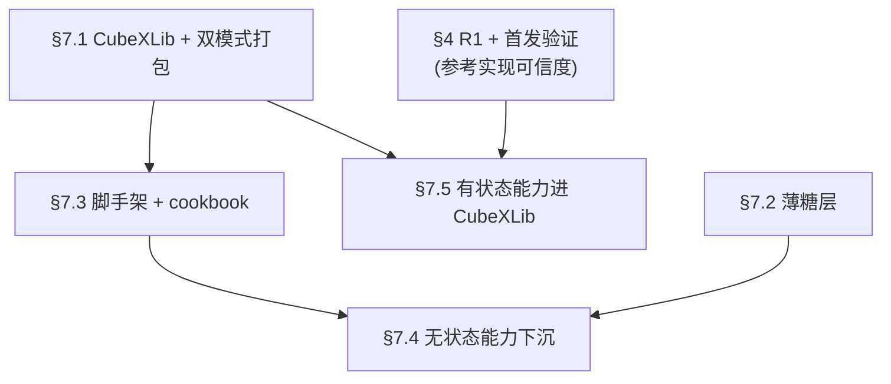

# CubeX-Plugins · 统一计划

> **本文件是全仓总体计划/进度记录。** 2026-08-17 由 13 份分散的计划文件合并而来；
> 原始全文保留在 git 历史（合并前最后一次提交 `2783844`）。
>
> 分工：约定与硬约束看 [`AGENTS.md`](AGENTS.md)，构建看 [`README.md`](README.md)，
> 架构看 [`ARCHITECTURE.md`](ARCHITECTURE.md)，共享模块用法看 [`MODULES.md`](MODULES.md)，
> 发布记录看各插件 `CHANGELOG.md`。新的待办集中写进本文件；**2026-09-07 用户指定的 Regions 本轮实施计划例外**，见 [`Regions/PLAN.md`](Regions/PLAN.md)，本文件只保留入口，不重复维护具体任务。
>
> **本文下方提到的 `CUBEX_*_DESIGN.md` / `ARCHITECTURE_PROPOSAL.md` / `ROADMAP.md` /
> `KOTLIN_MIGRATION_RUNBOOK.md` / 各插件 `IMPROVE_PLAN.md` 都已在 `484c1f6` 删除**，
> 保留它们只是为了标注结论的出处。要看原文用 `git show 2783844:<文件名>`，不要当成现存文件去找。

---

## 0. 当前执行入口（2026-10-01 核对）

**计划尚未全部完成。** Kotlin 迁移、10 个共享模块、CubeXLib 双模式、脚手架/cookbook、
薄糖层与 `explicitApi()` 已落地。剩余工作分别是代码实现、真实环境验收、发布准备和可选扩展。
本日索引核对只检查计划、源码及已有证据；随后 CT-A01 已运行 Contract 完整构建/测试与 jarGate，
证据见 §5.1，未运行实服测试。Metro/EcoBalancer 当前源码目录读取受限，其相关进度依据已提交记录，
后续施工前仍须读取实际工作树。

以下是执行索引；**勾选状态与证据只维护在指向的正文任务**。Regions 本轮具体验收任务以
[`Regions/PLAN.md` §10.2](Regions/PLAN.md#102-真实服务端与玩家任务) 为唯一清单。
旧日期的构建、冒烟和真人记录只适用于当时的包与环境，不自动覆盖新候选包。

| 任务 ID / 入口 | 工作性质与当前边界 | 前置条件 / 顺序 |
|---|---|---|
| `R1-V01`，§4 R1 | 真实 WAGER 故障与余额验收；连接/加载及自动化前置已完成 | 优先执行；需 Paper、目标 Folia、真实 Vault provider 与参与者 |
| `RG-V01`–`RG-V10`，Regions/PLAN §10.2；`REG-B01`，§5.2 | 本轮完整验收与首发数据基线；代码及隔离 Paper 冒烟已完成 | 按 Regions 清单准备环境并逐项保留记录；资金项引用 `R1-V01` |
| `CT-A02`，§5.1（A01 自动化已完成） | ALLIANCE 玩家入口；模型、注资与终态 service 已完成 | 结算/恢复门禁已通过；A02 按正文接玩家流程并保留多人实服证据 |
| `CT-V01`、`CT-V02`、`CT-B01`，§5.1 | SALE 真人链路、其余首发验收、首发数据基线 | SALE 真人验收维持原“暂缓”安排；准备工作与其他代码切片可独立推进 |
| `RGEMS-V01`，§5.3 | 最新共享能力升级的实服验收 | 真实经济插件/银行与原服数据副本 |
| `SC-V01`、`SC-B01`，§5.8 | StateCharge 正式 release 验收与数据基线 | 已实服使用；补未记录的矩阵，不把“投入使用”改成“未部署” |
| `CL-V01`、`REP-V01`，§5.9–§5.10 | Clarity/Reputations 首发验收 | 各自发布检查单、目标版本及真人环境 |
| `ECO-C01`，§4 R2 / §5.4 | 自定义事件税框架，未开工 | 可独立做；税收策略、账本与 Vault 线程约束保持现状 |
| `RW-R01`–`RW-R07`，§5.7 Railway 本轮 | 线程、乘车权限、票务、reload、编组传送与资源占用修复 | 2026-10-02 审计发现；按正文施工顺序，不能以现有单测全绿认定完整可用 |
| `RW-P01`–`RW-P05`，§5.7 Railway 本轮 | 三种物理模式的时序、状态、车距、轨道与兼容性补强 | 先统一运动命令与时间基准，再修各模式；默认仍为 reactive，未改变存档/配置 |
| `RW-D01`、`RW-V01`，§5.7 Railway 本轮 | 使用说明对齐、物理/平台实服矩阵与成熟度验收 | 代码切片完成后；需真实 Paper/Folia、Vault、Java/Bedrock 玩家，缺证据保持未勾选 |
| `MR-C01`，§5.7；`CT-R01`，§5.1 ITEM | 调度兼容层收敛、物品状态去重；非发布阻塞重构 | 分插件施工；不得混入玩法改动 |
| `CT-C01`–`CT-C04`，§5.1 | LOAN、共享池、评价、周期租赁 | 按各条目的范围与模型前置推进；周期租赁最后做 |
| `REG-D01`–`REG-D03`、`REG-E01`–`REG-E03`，§5.2 | Regions 长期方向，当前比赛链路不重做 | 本轮验收收口后；新资金语义另依赖 `R1-V01` |
| `CT-E01`，§7.4；`LIB-S01`–`LIB-S03`，§7.5 | Contract 入账路由、有状态服务下沉 | 严守正文前置；不能以重构替代资金/多人验收 |
| `BL-D01`、`ML-D01/02`、`SC-D01`、`REG-D04/05`、`RGEMS-D01` | 可选扩展或取舍，见各插件正文 | 先明确纳入/不纳入及完成标准；未选中的扩展不影响 core MVP |
| `ML-V01`，§5.6；`REPO-V01`、`REPO-M01`，§6 | 补实服证据、最终包人工检查、历史目录维护 | 按当前候选包记录；目录维护先确认 worktree 与未保存改动 |

每个任务完成时，在该条目后追加：`日期；实现提交或工作树范围；验证命令与结果；证据文件；
仍未覆盖的环境/路径`。没有执行的真人、余额、线程或崩溃恢复场景继续保持未勾选；
测试脚本和加载日志不能替代这些结果。纯 Markdown 更新只检查 diff 与链接，不为此构建全仓。

---

## 1. 仓库现状速览

| 维度 | 现状 |
|---|---|
| 插件数 | 12 个可独立安装：BookLite · FAWEReplacer · MountLicense · Contract · EcoBalancer · RuleGems · Metro · Railway · Clarity · Reputations · Regions · StateCharge |
| 运行时 lib | **CubeXLib**（2026-08-19 新建）：为外置模式插件以原包名提供 10 个 `cubex-*` 与 Kotlin stdlib。不进镜像同步 |
| 共享模块 | **10 个**：`cubex-core` · `cubex-config` · `cubex-i18n` · `cubex-scheduler` · `cubex-integrations` · `cubex-database` · `cubex-command` · `cubex-gui` · `cubex-spatial` · `cubex-economy`（2026-08-21 新建） |
| Kotlin 化 | ✅ 2026-08-16 收口。全部插件与模块 opt-in Kotlin 并继承 `CubexPlugin` |
| 字节码目标 | 全仓 Java 17；**Clarity 例外为 21**（1.21 属性 API）。`jarGate` 按各插件 release 分别校验 |
| 正式 release | 已有：BookLite · MountLicense · Metro · Railway · RuleGems · EcoBalancer · FAWEReplacer。待首个 release：Contract · Regions · StateCharge · Clarity · Reputations。源码可见性另算：Contract · Regions · Clarity 已在镜像名单 |
| 全仓自动化记录 | 最近记录为 `gradlew build jarGateAll` 与 `-p buildSrc test` 全绿（2026-09-27，§7.6）；这是历史验证，不代表 2026-10-01 工作树已重测或实服矩阵通过 |

遗留 `.java` 仅：vendored bStats `Metrics.java`、Reputations 的公开 Java API
（`org.cubexmc.reputations.api`，4 个文件，**故意保留**）、Metro/Railway 的互操作 shim。
**不要为文件计数迁掉它们。**

---

## 2. `modules/` 已支持的能力（按源码核对，2026-08-17）

### 2.1 `cubex-core` — 必选，12/12 插件接入

| 类型 | 能力 |
|---|---|
| `CubexPlugin` | `onEnable`/`onDisable` 为 `final`；业务写在 `enablePlugin()`/`disablePlugin()`。enable 抛异常 → 记 SEVERE + 自禁用；`abortEnable(reason)` → 记 WARNING + 自禁用（依赖缺失等**非错误**中止，如 Contract/StateCharge 缺 Vault）。disable 时先跑 `disablePlugin()`，再 LIFO 关闭全部 `bind(...)` 资源，单个失败不中断其余 |
| | `registerListener` · `registerCommand`（`plugin.yml` 缺声明时记 SEVERE 返回 false，不静默） · `saveResourcesIfMissing(vararg)` · `bindTask(handle, canceller)` |
| | `log()` / `messager()` / `text()` 均为 public |
| 资源栈 | `Terminable`(fun interface, `of(Runnable)`) · `TerminableConsumer` · `TerminableRegistry`（LIFO + `CloseFailureHandler`） |
| 契约接口 | `Reloadable` · `TaskCanceller`（均为 fun interface） |
| `CubexLogger` | `info/warn/severe/debug/log`，带/不带 `Throwable` |
| `CubexText` | `color`(null→"") · `colorOrNull` · `stripControl` · `nullToEmpty`；legacy `&` + `&#RRGGBB`，**零第三方依赖** |
| `Messager` | `send` / `sendLines` |
| `CubexCommandSuggestions` | `root(args, candidates)` 归一化 Paper `BasicCommand` 空数组与 Bukkit `arrayOf("")`；`matching` 大小写无关前缀过滤 |

### 2.2 `cubex-config` — 10/12

`ResourceFiles`（saveIfMissing/dataFile/exists）· `YamlFiles`（loadDataFile/loadResource/loadResourceUtf8）·
`YamlDefaults.mergeResourceIntoDataFile` + `DefaultMergeOptions`/`DefaultMergeResult` ·
**版本化迁移框架**（`MigrationPlan` + `MigrationRunner` + `MigrationStep`/`MigrationContext` →
`MigrationReport`，含备份、`MigrationFailurePolicy`、保存失败回滚）·
`LegacyTextToMiniMessageStep`（`AngleBrackets.PRESERVE`）·
`ReloadChain`（`ReloadFailurePolicy`/`addIf`/`ReloadReport`）· `ConfigReload.bukkitConfig`。

`ReloadChain` 目前由 **Contract · Regions · StateCharge · EcoBalancer** 4 家使用 → 见 §5.4。

### 2.3 `cubex-i18n` — 10/12

`I18nService`：`raw`/`rawOrNull`/`rawList` · `message` · `messageList` ·
`component`/`componentList`/`componentOf` · `send`；本身实现 `Reloadable`。
**每一类都有显式 `locale` 重载**（2026-09 为 Regions 的按玩家语言补齐）：同一条广播可以
逐接收者解析成各自的语言；旧签名全部委派新实现，行为不变。`render`（调用方自带模板）保持 locale 无关。
`I18nOptions` 覆盖语言目录、locale（值或 `Supplier`）、fallback 链、bundled locales、
`prefixKey`/`prefixToken`/`keyPrefix`、`MissingKeyMode`、`colorize`、`ColorMode`、`PlaceholderStyle`。
`ColorMode` = `LEGACY_AND_HEX` / **`MINIMESSAGE`（已实现）**；
`PlaceholderStyle` = `%n%` / `{n}` / `%1` / `<n>`(MiniMessage tag)。

> **设计文档已过期**：`CUBEX_CONFIG_I18N_DESIGN.md` §7 的"阶段 A/B 逐插件现代化"**已经走完**。
> 有 i18n 的 10 个插件全部引用 `ColorMode.MINIMESSAGE`（Clarity/Reputations 无语言文件），
> 9 个插件用 `MigrationRunner`（Regions 走自己的 `RegionBaseline`）。
> 以本节为准，不要再把它当待办。

### 2.4 `cubex-scheduler` — 7/12

平台探测（`isFolia`/`isPaper`/`isSpigot`）· 全局/异步/实体域/区域域 × 立即/延迟/定时 ·
`teleportAsync` · `cancelAll` · `bindTo(CubexPlugin)` · `CubexTask : Terminable` ·
`ManagedCubexTask`（任务体内自取消的竞态）· `LegacySchedulerAdapter` 兼容层。
FoliaLib 不向插件泄漏原 API。

### 2.5 `cubex-integrations` — 2/12（Contract · Regions）

`OptionalServiceConnector.connect(descriptor)` → `Connected` / `Unavailable(reason)`，
`ServiceUnavailableReason` 覆盖 `PLUGIN_MISSING`/`PLUGIN_DISABLED`/`API_CLASS_MISSING`/
`SERVICE_NOT_REGISTERED`/`SERVICE_TYPE_MISMATCH`。
从**提供方 ClassLoader** 加载 API class 再查 `ServicesManager`；**故意不缓存连接**；无状态。
**改动前先读 [`AGENTS.md`](AGENTS.md) 硬约束里“跨插件 API 面不得出现任何 Kotlin 类型”那条**——
它决定了这层能表达什么形状的 API（原 `CUBEX_INTEGRATIONS_DESIGN.md` 已删除，见本文开头）。

### 2.6 `cubex-database` — 3/12（BookLite · EcoBalancer · RuleGems）· 2026-08-17 新建

| 类型 | 能力 |
|---|---|
| `SQLitePragmas` | builder：`busyTimeoutMillis`/`wal`/`synchronous`/`foreignKeys`/`tempStoreMemory`/`cacheSizeKb`。**未设置的 pragma 不发语句**，保留 SQLite 默认而不是替服主猜 |
| `SQLiteDatabase` | 路径解析（相对→dataFolder，绝对→原样）· `openConnection()` 加载驱动 + 套 PRAGMA · `ensureParentDirectory()` · `jdbcUrl()` |
| | 两个兼容开关，用来保住各插件**原有**行为：`mirrorBusyTimeoutInUrl`（仅 EcoBalancer 开，它本来就把 busy_timeout 写进 URL）、`ignorePragmaFailures`（仅 EcoBalancer 开，它本来就吞掉 PRAGMA 失败）。默认都为关 |
| `JdbcOps` | `withConnection` · `inTransaction`（成功 commit / 失败 rollback，并还原 autoCommit） |

**不纳入（设计已锁定，别加）**：HikariCP、DAO、schema、迁移、事务重试。
`sqlite-jdbc` 在模块里是 `compileOnly` —— 各插件已各自打包且**绝不 relocate**，模块不能再塞一份。

### 2.7 `cubex-command` — 2/12（FAWEReplacer · RuleGems）· 2026-08-17 新建

| 类型 | 能力 |
|---|---|
| `CommandMaps` | `resolve(server)`：Paper `Bukkit.getCommandMap()` → CraftServer `commandMap` 反射兜底 · `knownCommands(map)` 取活 map（RuleGems 覆盖别人已占标签时要用） · `unregister(map, command)` **按身份**移除本命令及其别名 |
| `CommandRegistrar` | `registerPluginCommand`（`MissingCommandPolicy.WARN`/`THROW`，executor 同时是 `TabCompleter` 就一并注册） · `registerDynamicCommand` 返回 `Terminable`，可绑进 `CubexPlugin` 资源栈，disable 时自动撤销；可注入已缓存的 `CommandMap` |

**不纳入**：命令 DSL、Cloud annotations 封装、子命令路由模型。

> 接入时顺手修掉一个潜在 bug：RuleGems 原来按**名字**删 `knownCommands`，
> 若某标签被别的插件抢先注册，卸载时会把对方的条目一起删掉。
> `CommandMaps.unregister` 改为**按对象身份**匹配，只删真正属于自己的条目。

### 2.8 `cubex-gui` — 6/12（Contract · Metro · Railway · EcoBalancer · Regions · RuleGems）· 2026-08-17 新建

| 类型 | 能力 |
|---|---|
| `InventoryButton` · `Menu` · `MenuRegistry` | 由 Contract 的 `gui/framework/` 原样上移。按 Inventory 实例路由 click/close/drag/quit（取代"标题匹配 + 中央 `when(slot)` 分发"），`openMenu(playerId)`/`closeAll()` |
| `ItemBuilder` | `name`/`amount`/`lore`/`addLore`/`addEmptyLore`/`enchant`/`glow`/`flags`/`hideAttributes`/`customModelData`/`skullOwner`/`data`(String·Int PDC)/`guiMarker`/`build`。合并了 Metro、Railway、RuleGems 三份各自的实现 |
| `TextStyler` | 显示文本如何着色是**显式参数**：Metro/Railway 传 `&` 串走自己的 `ColorUtil`，走 `cubex-i18n` 的插件传已渲染文本用 `TextStyler.NONE`。传错会二次处理或漏出原始代码，所以不给"聪明"的默认推断 |
| `Pagination` | 纯页码算术，**不依赖 Bukkit**（GUI 与聊天分页共用）：`pageCount`/`clamp`/`hasPrevious`/`hasNext`/`firstIndex`/`lastIndexExclusive`/`countOn`/`slice`。1-based（与现有全部 `/… list <页码>` 一致）；空列表算 1 页空页；越界 clamp 不抛；`slice` 在"声明总数 > 实际取到行数"时不会越界 |

两个实现细节是有意的，别"顺手改"：
- `glow()` 的无害附魔常量在目标版本间改过名（1.18 `DURABILITY` → 1.21 `UNBREAKING`），
  因此**反射解析**；解析不到就不加附魔，而不是让整个物品构造失败。
- 没设过 lore 时**不写** lore 列表——写空列表会在名字底下多出一行空白。

Metro/Railway 各自保留同名 `org.cubexmc.metro.gui.ItemBuilder` 作为**薄适配器**
（只绑定自己的 `ColorUtil` 与 GUI 标记 key），因此 90 多个调用点一行没动；
构造逻辑本身已经在模块里。Metro 的 `guiMarker` 是它独有的增强，Railway 未移植，**维持现状**。

### 2.9 `cubex-spatial` — 2/12（Metro · Railway）· 2026-08-17 新建

`Point3D`（含 `Location` 构造）· `Range3D`（AABB：`contains`/`intersects`/`subdivide`/equals/hashCode）·
`Octree<T>`（读写锁 + 深度/容量分裂：`insert`/`remove`/`firstRange`/`getAllRanges`/`clear`）。
抽取前已核对 Metro 与 Railway 两侧内容**逐字节一致**（仅换行符不同）。
按既定纪律**只下沉无状态空间索引**，`StopManager`/`Stop` 留在插件内。

### 2.10 `cubex-economy` — 6/12（StateCharge · RuleGems · MountLicense · Metro · Railway · EcoBalancer）· 2026-08-21 新建

`VaultEconomy`（`has`/`balance`/`withdraw`/`deposit`/`charge`/`format` + `useAccount` 入账路由）·
`EconomyAccount`（`economy.account` 的纯解析：空 / `uuid:<uuid>` / 裸 UUID / `<玩家名>` / `bank:<名字>`）·
`OfflinePlayerLookup`（在线 → Paper `getOfflinePlayerIfCached` → 有存档的兜底，**不用** `getOfflinePlayers()`）·
`EconomyResult`（`success()` 只表示扣款侧；`depositFailed()` 是入账侧的旁路信号）。
两条不变量与取舍见 §7.4 的 `cubex-economy` 小节。

### 2.11 模块接入矩阵

| 插件 | core | config | i18n | scheduler | integrations | database | command | gui | spatial | economy |
|---|:--:|:--:|:--:|:--:|:--:|:--:|:--:|:--:|:--:|:--:|
| BookLite | ✅ | ✅ | ✅ | — | — | ✅ | — | — | — | — |
| FAWEReplacer | ✅ | ✅ | ✅ | — | — | — | ✅ | — | — | — |
| MountLicense | ✅ | ✅ | ✅ | — | — | — | — | — | — | ✅ |
| Contract | ✅ | ✅ | ✅ | ✅ | ✅ | — | — | ✅ | — | — |
| EcoBalancer | ✅ | ✅ | ✅ | ✅ | — | ✅ | — | ✅ | — | ✅ |
| RuleGems | ✅ | ✅ | ✅ | ✅ | — | ✅ | ✅ | ✅ | — | ✅ |
| Metro | ✅ | ✅ | ✅ | ✅ | — | — | — | ✅ | ✅ | ✅ |
| Railway | ✅ | ✅ | ✅ | ✅ | — | — | — | ✅ | ✅ | ✅ |
| Regions | ✅ | ✅ | ✅ | ✅ | ✅ | — | — | ✅ | — | — |
| StateCharge | ✅ | ✅ | ✅ | ✅ | — | — | — | — | — | ✅ |
| Clarity | ✅ | — | — | — | — | — | — | — | — | — |
| Reputations | ✅ | — | — | — | — | — | — | — | — | — |

---

## 3. 模块层：计划已全部完成 ✅

`CUBEX_CORE_DESIGN.md` §2/§3 与原 `ROADMAP.md` §4 列出的候选模块**已全部落地并接入真实使用方**
（2026-08-17）。没有剩余的模块层计划。

| 模块 | 出处 | 落地方式 |
|---|---|---|
| `cubex-database` | `CUBEX_CORE_DESIGN.md` §2.4/§3.4 | 新建，接入 BookLite/EcoBalancer/RuleGems 三家 |
| `cubex-command` | `CUBEX_CORE_DESIGN.md` §2.5/§3.5 | 新建，接入 FAWEReplacer/RuleGems |
| `cubex-gui` | 原 `ROADMAP.md` §4 | 从 Contract `gui/framework/` 上移 |
| `cubex-spatial` | 原 `ROADMAP.md` §4（2026-08-02 审计） | 从 Metro/Railway 上移，两侧同时切换 |

### 3.1 与 NewNanCity 的对标复审（2026-08-17）

参照 `reference/NewNanCity-Plugins` 做过一轮能力对比。两边地基一致（Gradle + buildSrc 约定插件 +
monorepo + shade 进各 jar + Terminable 资源栈 + BasePlugin 生命周期模板），差异在投入方向。

**已按实测重复吸收的**：`ItemBuilder` 与 `Pagination`（见 §2.8）。
判据是实测调用点，不是"他们有所以我们也要有"：

| 能力 | 实测重复 | 结论 |
|---|---|---|
| 页码算术 | `max(1, ceil(n/size))` 在 Contract ×2、EcoBalancer ×2、Metro ×6、Railway ×5 出现，另有 `EcoBalancer/PageUtils` | ✅ 抽取 |
| ItemStack 构造 | Metro / Railway / RuleGems **三份独立 `ItemBuilder`**，另有 ~8 处直接操作 `ItemMeta` | ✅ 抽取 |

**明确不吸收的**（复审已否，不要再提，除非重复度变了）：

| 他们有的能力 | 我们的实测情况 | 不做的理由 |
|---|---|---|
| `MinecraftVersion` 版本探测 | 只有 `Metro/VersionUtil` 与 `Railway/VersionUtil`——**同源同一份代码，实际 1 个使用方** | 不满足"两个真实使用方" |
| `SkullUtils` 独立工具 | 只有 RuleGems 用头颅，**1 个使用方** | 已作为 `ItemBuilder.skullOwner` 顺带覆盖，不单开工具类 |
| 事件订阅 DSL（`EventFilters` 等） | 各插件用裸 Bukkit Listener，**没有实测痛点** | 纯投机抽象；`CubexPlugin.registerListener` 已覆盖注册样板 |
| `BaseModule` 插件内模块树 | 我们的插件在 `enablePlugin()` 里手写编排，暂未出现编排失控 | 收益未证实；真需要时应由 Contract/Regions 的实际疼痛驱动，而不是先建框架 |
| 日志 provider / formatter / `PerformanceMonitor` | 各插件用 `CubexLogger` 够用；EcoBalancer 的文件 logger 是业务特性 | `CUBEX_CORE_DESIGN.md` §5.1 已定：不让 core logger 吃掉业务日志特性 |
| Jackson 多格式配置 | 全仓已统一 Bukkit YAML + 版本化迁移框架，10 个插件在用 | 换掉会推翻所有现有配置文件与刚落地的迁移链，代价远超收益 |

**顺带记录两点他们的做法我们不采纳**：他们的约定插件里 `tasks.withType<Test> { enabled = false }`
（测试从不运行）；他们只 relocate `org.jetbrains.kotlin` 与 `kotlin.reflect`，不 relocate `kotlin.*`
stdlib。我们的 `jarGate` 强制 `unrelocatedKotlin=0` 且测试随每次构建运行，**保持现状**。

**继续维持的铁律**：有状态的共享服务 = **独立插件**（单实例持数据，如 Reputations）；
无状态的共享代码 = **shade 进各 jar 的模块**。把有状态服务做成 shade 模块会让各插件各持一份、互不共享。
新模块要加进 `settings.gradle.kts`；新**插件**才需要加进 `CubexRelocations.kt` 的 pluginIds。

### 3.2 新增共享能力的准入门槛（2026-08-19 修订）

原门槛只有“**(a)** 至少两个真实使用方 + **(b)** 抽取提交只做搬迁”。它是为**收敛 monorepo**
设计的，判据是“我们自己重复了几次”。定位改成“团队 + AI agent 共用的插件开发框架”之后
（见 §7），这把尺子量不出框架该有的东西，因此替换为四条，**必须同时满足**：

- **(a)** 两个真实使用方（**同源代码算一个**——Metro/Railway 是同一份代码），
  **或**明确是下一个新插件会用到的通用能力；
- **(b)** 没有维护良好的第三方库做得更好。有就**依赖或封装它，不重造**——
  Cloud（已 shade 进 Metro/Railway/RuleGems）、Adventure、scoreboardlibrary 已在此列；
- **(c)** **无状态**才能做 shade 模块。需要持有跨插件共享的运行时状态 → 进 CubeXLib（§7.1），
  不得下沉成 shade 模块；
- **(d)** 落地时**同时**进 cookbook 一个可编译可测试的范例。没有范例的能力，对 agent 等于不存在。

外加原 (b) 的施工纪律仍然有效：**抽取提交只做搬迁，先让一个插件切过去并过
`shadowJar`/`jarGate`，再推广另一侧。**

---

## 4. 跨插件路线（2026-08-17 复审，已剪掉不成立的条目）

复审标准：**有没有真实使用方**、**是否与"插件互不依赖"的硬约束冲突**、
**是否只是换皮**。下面标 ❌ 的是本次**移除**的条目，不要再捡回来。

### R1 — Regions ↔ Contract WAGER 托管 · 唯一高优先级项

第一阶段已完成：Contract 暴露窄接口 `ContractEscrowService`；`dual_pvp`/`union_war` 可配
`reward-source: contract`；Regions 用 `reward-funding.yml` 存 lease，重启/reload 以**同一 operation id**
重放 lock/settle/refund，部分付款或状态不明 → `REVIEW_REQUIRED` 人工复核，绝不二次付款。

- [ ] **`R1-V01` 真实 Paper/Folia + Vault 双插件故障注入验证** — 这是全仓剩余项里价值最高的一条：
      它是"真钱跨插件流动 + 重启重放"唯一还没有实服证据的环节。
      场景至少覆盖：settle 中途关服、Vault provider 中途卸载、Contract 先于 Regions 卸载、
      同一 operation id 重复提交、`REVIEW_REQUIRED` 后的人工处理路径。
      - [x] **2026-08-24 自动化前置已补齐**：Paper 1.21.11 + Vault + EssentialsX +
        Contract + Regions 联合 `runServer` 实测加载成功；Regions 通过提供方 ClassLoader 调到真实
        Contract 服务，并对不存在的 WAGER 返回 `CONTRACT_NOT_FOUND`。
      - [x] **提供方缺席保全已实服验证**：无 Contract 的独立 `runServer` 重载返回
        `PROVIDER_UNAVAILABLE`，停服前后 `PREPARING` lease 与 operation id 原样保留。
        双侧单测另覆盖落盘重启后的同 operation 重放、终态不重复付款、`REVIEW_REQUIRED`
        不转退款。
      - [x] **2026-09-23 锁定回执不确定性加固**：Regions 在 lock 未确认时保留持久化
        `PREPARING` lease；开赛中止及重启先用原 operation id 退款，无锁时同 ID 重放锁定再退款。
        自动化覆盖已提交锁与未提交锁两端；联合 Paper 仅复验加载和无效 WAGER 连接。
      - [x] **Contract 已落盘锁重放**：相同 operation id 与场地在 WAGER 后来完成或进入争议后仍返回
        `REPLAYED`；不同 ID／场地拒绝，新的资格检查仍拒绝终态合同。持久化重启用例、Contract
        全量测试与联合 Paper 加载通过，未据此勾选真人资金故障注入。
      - [x] **Vault 失败回执的付款待办保全**：Contract 在入账调用返回失败后保留该笔 write-ahead
        `DEPOSIT`，将 WAGER 标记争议并以 `REVIEW_REQUIRED` 阻止第二次付款。自动化覆盖首笔失败与
        第二笔回执丢失的部分付款；真实 Vault 余额核对和人工处理仍待实服。
      - **尚缺的验收证据**：真实 WAGER 的 settle 中途关服、Vault provider 中途卸载、
        Contract 先卸载、人工处理 `REVIEW_REQUIRED`，并在 Paper 与 Folia 核对余额守恒。
      **执行入口**：[`Regions/REAL_PLAYER_TEST.md`](Regions/REAL_PLAYER_TEST.md) 的 Contract 奖励托管、
      [`Contract/docs/release-checklist.md`](Contract/docs/release-checklist.md) 及两侧资金回归测试。
      **完成条件**：每个场景记录双方/服务器账户前后余额、托管本金、operation id、两侧 lease/审计日志、
      jar SHA-256 与环境版本；成功终态不双付，结果不确定时保留复核证据，缺 provider 不丢记录，
      人工复核有可复现处理与处理后核账记录。Paper 与目标 Folia 分别通过；只加载服务或返回
      CONTRACT_NOT_FOUND 不算本项完成。测试环境与真人缺席时记录具体缺口，不能用模拟 Vault 勾选。
- ❌ ~~race / hide-and-seek / 赞助 / 多人分成的结果语义~~ —— 不是独立条目。
      竞速/捉迷藏运行链路现已补齐，新增资金语义仍统一在 §5.2 `REG-D02` 定义，单列会造成两处漂移。

### R2 — EcoBalancer 基于自定义事件的税收（`ECO-C01`，未开工）

让税收不止"定时/交易"，而可挂在**自定义游戏事件**上（示例：`keepInventory` 生效时的死亡税）。
需要**可扩展的"触发器 → 税目"框架**：事件源 + 条件 + 税率/税额 + 去向（销毁/系统/国库），
服主可配置可增删，**而非硬编码每一种税**。

保留理由：这是本轮复审里**唯一新增玩家可见价值**的跨插件项，且已有天然落点——
`TaxRunService` 的执行生命周期（账本、PAPI、进度状态都已挂在那里）。

- [ ] **`ECO-C01` 事件税框架**：先在插件设计文档中定义可配置事件源、条件、税率/定额和
      销毁/系统/国库去向；以一个实际事件（例如 keepInventory 生效的死亡）交付完整切片，再扩事件源。
      复用 TaxRunService/TaxLedgerService/策略系统，不硬编码一税一监听、不提前下沉 quest。
      **完成条件**：取消/重复事件、免税、欠款、reload 注册撤销、Vault 拒付/异常与账本金额都有回归；
      异步事件的 Vault/实体访问按目标平台调度，真实事件触发后余额与账本相符；
      `:EcoBalancer:build` / `:EcoBalancer:jarGate` 与实际 provider 实服验证有记录，双语配置/README 同步。

### R3 — Reputations 完善（大幅收窄）

Reputations 目前**只有 Contract 一个消费方**，且尚未发布首个正式版本。在第二个字段提供方出现前，
按"可扩展性"预建抽象正是各设计文档反复警告的投机性设计。

保留：
- [x] 排行榜 + 信誉变动事件广播 + PlaceholderAPI 占位符（2026-08-24）：
      `/reputation top <field> [page]` 按 `higherIsBetter` 排序，同值共享名次，只纳入该字段已有持久化值的玩家；
      `ReputationChangeEvent` 是 Java Bukkit 事件，异步调用服务时事件也标记为异步；PAPI identifier
      为 `reputations`，提供玩家 value/rank 与全服 top name/value，占位查询由 store revision 缓存失效。
      PlaceholderAPI 维持可选，缺席或注册失败只降级；依赖排除其 Adventure 副本。

移除：
- ❌ ~~外部属性 provider SPI + 软依赖适配器（Lands 国家/领袖）~~ —— 没有第二个提供方，
      SPI 的形状只能靠猜；等真有 Lands 接入需求时再按当时的真实数据定。
- ❌ ~~衍生评分/等级(tier) 与加权聚合~~ —— 权重口径本身就是未定的玩法决策
      （原文档已记录"改分公平性顾虑"），先做只会做错。
- ❌ ~~历史数据幂等导入工具~~（原 R0 待办）—— Contract 展示读的是**自己的**
      `reputation.yml`，玩家看到的数字已经正确；聚合服务目前没有第二个消费方去读那段历史。
      等真有跨插件消费方时再做，届时才知道要导成什么形状。

### R0 — Contract ↔ Reputations（第一阶段完成，剩余项已清空）

已完成：Contract 经 `cubex-integrations` 注册 `Contract:completed/cancelled/expired/disputed`
并把**新增量** best-effort 镜像过去；Reputations 缺席/禁用/不兼容时 Contract 完整独立运行。

- ❌ ~~让展示优先读聚合服务~~ —— **与硬约束直接冲突**：那会让 Contract 的展示依赖
      Reputations 是否在线，而"每个插件必须能单独安装、缺席时完整运行"是不可让步的边界。
      本条不是"以后再做"，是**不做**。

### R4 — 统一指令格式（收窄为"新增代码遵守 + 文档化"）

现状：根补全的形态差异已由 `CubexCommandSuggestions` 统一；动态命令注册/撤销已由
`cubex-command` 统一。剩下的是权限命名、`help`/`usage` 渲染、提示与颜色规范。

- [x] 写一份命令/权限规范（2026-08-25）：[`COMMAND_PERMISSION_GUIDE.md`](COMMAND_PERMISSION_GUIDE.md)
      已统一 `<plugin>.<area>.<action>` 叶节点、`.use`/`.admin` 聚合节点、help/补全权限过滤、
      usage 写法、MiniMessage 颜色及已有 release 节点的兼容纪律。**新代码与待首个 release 插件的命令面遵守**；
      既有简写节点不作为新代码范例，也不对已有 release 插件做无兼容期改名。
- ❌ ~~回头重命名已有 release 插件的权限节点~~ —— 这 7 个插件的权限节点是服主
      配置文件里的公共契约，批量重命名会**静默破坏线上权限组**，代价远超收益。
      要改只能随大版本 + 提供旧节点兼容期，不作为常规待办。

---

## 5. 各插件待办

### 5.1 Contract（待首个正式 release）

资金核心、WAGER、PARTNERSHIP、GUI 大厅化（铁砧已彻底移除）、Reputations 桥、
Regions escrow API、bStats 均已完成。

#### 合同类型审计（2026-08-17）：7 种能否由 3 种原始类型表达

已实现的三种原始类型：**SERVICE**（单边押注 + 开放接单 + `OWNER_APPROVE`）、
**WAGER**（双边押注 + 具名对手 + `ARBITER`）、**PARTNERSHIP**（双边押注 + `BOTH_APPROVE`）。

| 类型 | 结论 | 依据 |
|---|---|---|
| **BOUNTY** | **✅ 完全冗余，已删除** | `SERVICE` + `ResolutionRule.SYSTEM_OBJECTIVE` + `ContractObjective`（18 种 `ObjectiveType`，含 `KILL_PLAYER`/`KILL_ENTITY`）**已经实现**了"第一个完成 X 的人自动结算"，`ContractService` 里有 `SYSTEM_OBJECTIVE_COMPLETED` 结算路径。单独加 BOUNTY 只是把 OWNER/CONTRACTOR 改名成 POSTER/CLAIMER |
| **SALE** | **✅ 自动化实现完成；真人验收待做** | 卖家主手整组物品与买家 Vault 价款均有签署确认；service 处理接受/双方审批，`ItemClaimPlan` 处理成功交换、返还与裁决，GUI/命令/收件箱/详情页均可创建、处理和领取。尚未做 Paper/Folia 真人链路 |
| **ALLIANCE** | **底层、注资与终态 service 自动化完成；玩家入口待接** | UUID 审批、逐成员注资、取消/超时退款与具名违约付款已接入；UUID 计划及 READY/PAYING/PAID 防双付恢复通过自动化，尚未开放玩家创建或完成真实余额验收 |
| **LOAN** | ❌ **不可归约** | 需要 **initial-transfer**：创建时钱**直接转给** debtor 而非进托管。现有全部类型都是"押注进托管"，没有任何一条路径让资金在结算前离开托管。另需还款动作与到期自动判决 |

**落地结论**
- [x] 删除 `ContractType.BOUNTY`、`ResolutionRule.EVENT`、`ParticipantRole.POSTER/CLAIMER`
      及其语言键；顺手修好 `templates.yml` 的 `preset_bounty`——它本来就写着
      `objective-type: KILL_PLAYER`，却挂在没有创建路径的 `BOUNTY` 类型上（**等于一个发不出去的预设**），
      现改为 `type: SERVICE`，玩法不变
- [x] **SALE**（自动化范围完成；真人验收按当前要求暂缓）：
      - [x] 底层（2026-08-25）：`Contract.createSale(...)` 建立双方交换/返还/争议裁决规则；
        `ItemClaimPlan` 在外部付款前按 participant role 路由实物，拒绝不可唯一交付的规则；
        `item-claims.<recipient>.<source>` 持久化终态领取权，覆盖重启恢复、旧 SERVICE 物品池回退、
        背包满与存档失败回滚。单测覆盖成功交换、失败返还、歧义规则失败关闭和新旧存档形状。
      - [x] Service 状态机（2026-08-25）：`createSale` 托管卖家完整主手 stack、存档失败原样归还；
        受邀买家以独立 `sale-accept` pending operation 托管价款，双方复用互相审批状态机后执行交换。
        自动化测试覆盖 accept dispatch、第二次审批结算、卖家收款与买家物品领取权。
      - [x] 玩家入口（2026-08-25）：`/contract sale` 预填并打开签署确认，GUI 创建器新增 SALE；
        确认页回显完整主手物品组、买家与价款，确认后主手变化会失败关闭。详情页与行动收件箱
        覆盖接受、双方审批、争议裁决和结算物品领取；lang v3→v4 自动补齐双语键且保留服主改文。
      - [ ] **`CT-V01` SALE 真人验收（按既有用户安排暂缓）**：发布前覆盖 Paper/Folia 真实 Vault 余额、
        背包满、确认页换手防护、重启后领取与中间人裁决；记录交换前后完整物品元数据、余额、
        item-claims 与审计日志，证明未吞/复制物品、未双付。当前可完善脚本/候选包，不能把暂缓改成已通过。
- **ALLIANCE 进度汇总**（具体待办为下方 CT-A01/CT-A02）：`createAlliance` + `PENDING_ACCEPT_MULTI` + **动态生成 payouts**
      （已定方案 B：违约时按当时状态构造规则；不采用方案 A 加 `SourceSelector`，避免模型膨胀）
      - [x] 底层切片（2026-08-27）：`createAlliance` 创建 3 人以上、OWNER + 多个 ALLY 的纯金钱合同；
        `AllianceAgreement` 是按 UUID 区分的不可变已注资签署/审批快照，全部签署后才允许审批。
        `alliance.version: 1` 保存签署时间和审批人；异常记录拒绝加载，不静默丢弃或回退到旧签署备份。
      - [x] 动态分配计算（2026-08-27）：`AlliancePayoutPlan` 只计算本金、不执行付款；
        待签署退款仅覆盖已注资成员，成功要求全员签署及审批，违约按具名 UUID 分配本金。
        守约者先收回自己的本金，违约者本金以整数分均分；尾差按 UUID 排序分配，逐来源守恒。
        无 `SourceSelector`，无把多个 ALLY 当成首个 ALLY 的角色查找。验证记录见
        [`Contract/docs/alliance-model-evidence.md`](Contract/docs/alliance-model-evidence.md)。
      - [x] 注资 service（2026-08-27）：`ContractService.createAlliance` 与 ALLIANCE accept 分派
        接入逐成员 Vault 扣款；已注资签署 + `alliance-funding-op-<uuid>` 共同落盘，最后一人签署才激活。
        部分签署仍计入盟友接受上限；权限、重名 UUID、并发重复签署、旧对象和保存失败回滚有测试。
      - [x] 分阶段恢复（2026-08-27）：pending 增加 `funding-phase`，先记 PREPARED 再扣款，
        以 WITHDRAWN 确认扣款；退款先记 REFUNDING，确认成功后为 REFUNDED。明确拒绝为 REJECTED。
        已落盘签署必须按 UUID、金额、操作 ID 匹配才清日志；PREPARED/REFUNDING 的不确定结果保留人工核对，
        不自动重付。共享日志改为严格读取和同目录原子替换，保留旧记录格式。证据见
        [`Contract/docs/alliance-funding-evidence.md`](Contract/docs/alliance-funding-evidence.md)。
      - [x] **`CT-A01` 终态结算 service（自动化范围，2026-10-01）**：全员 UUID 审批、未全签取消/超时退款、
        全签取消转争议、管理员退款与具名 UUID 违约裁决已接入；付款前持久化完整 source/recipient 分配、
        发起人、签署快照及逐收款人 READY/PAYING/PAID，合同保存操作 ID。已确认付款跳过重放；
        未执行付款可恢复，未知 Vault 结果保留人工核账锁。未决注资/结算阻止签署、二次结算、直接关闭和清理。
        工作树范围：Contract 模型、service、pending、严格审计写入、lang v6→v7、测试与文档；无提交/推送。
        验证：定向 87 项通过；`.\gradlew.bat :Contract:clean :Contract:build :Contract:jarGate --console=plain` 通过；
        全员/部分签署、并发重复审批、尾差、落盘/付款中断与真实临时 YAML reload 均有自动化记录。
        两份旧 alliance evidence 已补后续入口，完整记录见 [`Contract/docs/alliance-settlement-evidence.md`](Contract/docs/alliance-settlement-evidence.md)。
        **未覆盖**：真实 Paper/Folia/Vault 余额、线程与真人链路；继续按 CT-V02/A02 保留实服证据，未以模拟测试代替。
      - [ ] **`CT-A02` 玩家命令/GUI**：在 A01 通过后接完整成员与各自押金预览、一次确认、签署进度、审批、具名裁决；
        在 service 与恢复门禁完成前保持 ALLIANCE 不可从玩家入口创建。
        **完成条件**：普通玩家完整创建→签署→审批/裁决→领取；权限、旧 GUI、换手/输入变化与重复确认
        不能越权或重复注资，双语命令/help/页面完整，自动化与多人实服流程均留证。
- [ ] **`CT-C01` LOAN**：先定 initial-transfer、还款、可选抵押物与到期自动判决模型，
      不能复用“结算前钱始终在托管”的旧假设；按模型/存储→转账恢复 service→玩家入口拆批。
      完成条件：放款/还款/逾期/抵押物返还或交付在故障重放后无双付/丢物，旧合同兼容；
      双语文档、自动化与真实余额/物品验收齐备。
- [ ] **`CT-C02` PARTNERSHIP 共享池**（sharedPool）：先确定所有权、注资/退出/分配及旧双边合同兼容；
      以唯一持久化本金来源接 service/GUI，完成条件为分配守恒、并发/重复操作/重启恢复测试与实服核账。
- [ ] **`CT-C04` RECURRING 租赁（最后做）**：父合同生成子合同，不在 Contract 内加 schedule 字段；
      先定周期、取消、补发/漏期与余额不足语义。完成条件：每周期子合同唯一、重启/reload 不重复生成，
      子合同独立结算/恢复，旧存档兼容，自动化及实服跨周期记录齐备。

#### ITEM 资产（2026-08-17 完成）

审计发现原计划描述有两层：**SERVICE 的物品托管早就实现了**——`Contract.deliveryItems`/`rewardItems`
持有真实 `ItemStack`，由 `ContractStorage` 以 `ItemStack.serialize()/deserialize()` 持久化，
GUI 有完整领取流程；`Asset` 的展示串重复问题也已修好。2026-08-25 又补上按 participant role
生成并持久化终态领取权的通用层；旧 SERVICE 池继续作为旧存档与降级兼容面。SALE 玩家入口已于
2026-08-25 接入命令、GUI、详情页和行动收件箱，真人运行时验收仍待发布前执行。

- [x] `Asset` 的 ITEM 改为携带真实 `ItemStack`（`Asset.item(stack)`、`itemStack()`、`itemCount()`），
      `toMap`/`fromMap` 走 `ItemStack.serialize()` 往返，并**同时保留** `reference` 展示串
- [x] 旧存档兼容：只有 `reference` 没有 `item` 的记录照常加载（不臆造 stack）；
      `item` 载荷损坏时退回展示串而不是让整份合同加载失败
- [x] `Participant.itemStake()` / `itemStakeAmount()`；`AssetTest` 覆盖新旧两种格式与损坏载荷
- [x] 通用终态领取：`ItemClaimPlan` 依据实际 `PayoutRule` 把每个 source role 的实物路由给唯一
      participant recipient；`ContractService` 在 Vault 付款前先验证，并把领取权按 recipient/source
      双层角色持久化。领取存档失败恢复合同与背包；旧 SERVICE 展示型 stake 回退到 reward/delivery 池
- [ ] **`CT-R01` 物品状态去重**：让 `deliveryItems`/`rewardItems` 与参与者 stake 共用同一份数据
      （现为同源写两处）——非发布阻塞重构。完成条件：旧 SERVICE/SALE 存档往返及领取/返还路径
      不丢元数据、不重复交付，必要迁移有测试；仅提交本重构，Contract build/jarGate 通过。

#### PlaceholderAPI（2026-08-17 完成）

- [x] `ContractPlaceholderExpansion`（identifier `contracts`）：`open_count`、`total_count`、
      `my_active`、`my_pending_wager`、`my_open_posted`、`my_disputed`、`open_reward_total`。
      只读快照 + 2s 缓存（计分板每 tick 都会来问）；PlaceholderAPI 缺席/注册失败只记日志不影响启用；
      `softdepend` 加 `PlaceholderAPI`；PAPI 自带的 Adventure 被 `exclude`，避免它顶掉 paper-api 钉住的版本

#### 其他

- [ ] **`CT-C03` 声望/评价系统**（`DESIGN.md` §8.4）：先明确互评资格、重复评价和上限计算；
      合同完成后双方互评，reputation 影响 `max-open-contracts`，不预建 R3 已否决的 provider/tier 抽象。
      完成条件：评价可持久化且不重复、旧计数与评价字段区分，Reputations 缺席时 Contract 独立运行，
      可选桥失败只降级；自动化、权限/双语及真实玩家展示有记录。
- [ ] **`CT-B01` 首发数据基线**：在最终候选包登记合同存档、`events.log`、pending journal、
      escrow lease、config/lang 版本及旧格式边界；完成条件为发布检查单、备份/回退说明与已需迁移测试齐备。
      公开版本之后任何格式变化必须提供单向迁移 + 自动化测试。
- [x] 补 `Contract/docs/release-checklist.md`（2026-08-25）：含自动门禁、最终 JAR 的
      `plugin.yml` / bStats 31491 / 无 SQLite / Paper 提供 Adventure 四项人工确认、部署前恢复检查与真人验收
- [ ] **`CT-V02` 其余首发实服验证**：执行 `Contract/docs/release-checklist.md`，覆盖旧合同升级、
      核心三类型、物品领取、权限/GUI/聊天、provider 缺席、重载/停服及不确定付款恢复；
      资金跨插件与 SALE 分别引用 R1-V01/CT-V01 的同一份证据，不重复声称已验。
      完成条件：当前候选包每项有环境、预期/实际与数据结果；记录仍不开放的类型，不把 ALLIANCE 底层算作玩家功能。

**跨阶段不变量（底线，每阶段都必须维持）**
1. **资金状态一致** — 任何时刻 `余额 + 托管 = 之前余额`，宕机/reload 后仍成立
2. **审计完整** — 所有资金流动**先** append 到 `events.log`，**再**改 contract 状态
3. **兼容** — 引入新类型时老合同读写不破坏
4. **新类型必须有单测** — 资金分配规则、状态机转换、超时处理至少各一条

**GUI 遗留决策（动 GUI 前先看）**
- 进一步拆成 `HallGui`/`DetailGui`/`CreateFlow` 三控制器需要回指或重复代码；
  `ContractGui.kt` 现 747 行已达标（<800），**暂不强拆以免伤内聚**
- Contract 编译目标是 **paper-api 1.21.11 / 输出 release 17**，shadowJar **不 bundle/relocate Adventure**
  （由 Paper 提供）。Dialog API 仅 1.21.6+ 经 `Class.forName` 探测后启用，旧服回退 GUI+聊天。
  **代价：不再支持纯 Spigot 服**（仍支持 Paper 1.18+）
- `ChatInputService` 必须同时监听 Paper `AsyncChatEvent` 与旧 `AsyncPlayerChatEvent`。
  **2026-08-19 订正**：这条此前只是"要求"，源码里 Contract 其实**只监听 legacy**。
  随 §7.4 的 ChatInput 下沉一并补上了现代事件监听，现在名副其实

### 5.2 Regions（待首个正式 release）

**本轮实施入口（2026-09-07，状态核对至 2026-10-01）**：[Regions 使用体验、国际化与战斗玩法实施计划](Regions/PLAN.md)。Nation 工会战、单命大乱斗、双人 PVP、国际化、流程与恢复的代码和自动化已落地；完整实服/真人验收尚未收口。以下保留历史基线与长期方向，本轮具体任务及勾选以该文件为准。

阶段 A（授权与能力真实性）、B（模板化创作与发布）、C（运行时完整度与组合规则）代码层已收口；
Paper 1.21.11 build 132 启动/reload/关闭/端到端控制台流程已验证。

- **历史真人记录（2026-08-17）**：旧计划曾把 GUI、状态清理、装备恢复、授权和多人流程记为完成。
      本次未定位可复用的逐项真人证据；该记录不覆盖本轮八玩法候选包。当前待执行任务见
      [`Regions/PLAN.md` §10.2](Regions/PLAN.md#102-真实服务端与玩家任务)，实际已有证据见
      [`Regions/docs/completion-2026-09-22.md`](Regions/docs/completion-2026-09-22.md)。
- [x] **接入 `MigrationRunner`**（2026-08-20）：此前 `RegionBaseline` 只做"版本对不上就抛异常"
      的校验，**没有任何迁移能力**。版本表仍留在 `RegionBaseline`（5 个文件的单一来源），
      但备份、原子写、保存失败回滚与失败报告都交给 `cubex-config`。现已有语言 6→7→8→9→10→11
      与模板迁移；以后格式升级继续增加版本与迁移步骤，覆盖旧值保留、失败与重复执行。
      至此 Regions 与 Contract 的模块接入完全一致
- **本轮已落地的实现索引**：错误/状态/审计原因按语言键渲染，GUI 与广播按接收者 locale 渲染；
      进区报名提示冷却、草稿 revision 守卫及重载菜单刷新也已实现。完成记录统一见 Regions/PLAN
      M1/M2.5 与 §4.4；人工排版与真人双语验收仍在该文件，不在根计划重复维护。
- [ ] **`REG-B01` 首发数据基线**：首发准备时核对最终 jar 与 `RegionBaseline`，登记全部存档/schema。
      当前源码：config 4、regions 4、templates 2、lang 11、escrow 1、match-store 1；正式基线随首发确认。
      完成条件：发布检查单记录版本、备份/回退边界与已有迁移链；公开版本之后的变化有单向迁移和自动化。
- **阶段 D 的已实现部分**：报名/准备/开赛/结果/恢复链路、规则快照及决斗/工会战 WAGER 接口已存在。
      剩余切片如下；本轮验收收口后再扩展，不重做已有状态机。
- [ ] **`REG-D01` 活动排期与归档**：在既有比赛模型上定义活动生命周期、排期取消/重启语义与归档读取；
      验证旧比赛存档兼容、同一活动不重复开赛、归档可追溯名单/revision/强制操作/结算摘要。
- [ ] **`REG-D02` 新奖励语义**：在 `R1-V01` 通过后，先确定赞助、竞速/捉迷藏及多人分成的出资方、
      胜负/并列/退出/中止规则，再接 Contract 幂等结算；自动化和真实余额测试均证明不重付、可恢复。
- [ ] **`REG-D03` 活动占位符**：为场地/活动/成绩/资金提供只读快照及缺依赖降级；有键表、缓存失效测试
      和真实 PAPI 返回值记录，不从占位符调用修改比赛或资金状态。
- **阶段 E**：排在本轮验收与相关运行模型稳定之后；跨插件接口继续遵守根 AGENTS 的类型/隔离约束。
- [ ] **`REG-E01` 注册 API**：Source/Mode/Flag/Effect/Condition/Action 的生命周期、冲突与注销契约，
      同时接能力真实性校验；带可编译示例与缺 provider/重复注册/重载回归，不只开放字符串入口。
- [ ] **`REG-E02` 新 Source**：在 E01 后按真实需求逐个接 Residence/WorldGuard；明确 owner/转让/失效
      映射，在实际目标 provider 上验证授权、区域检测和依赖降级；不改变现有 owner AND admin 门禁。
- [ ] **`REG-E03` 模板交换**：导出/导入、签名与版本兼容校验；先确定信任与升级语义，再验证损坏、
      不兼容版本及提权 Action 被拒，往返不丢参数，带使用文档。
- [ ] **`REG-D04` Brigadier 取舍（可选）**：当前 Lifecycle Command API 已够用；先证明强类型节点的
      用户收益并确定迁移范围，若纳入则保留旧语法/权限/补全兼容并验收，否则明确退出当前版本。
- [ ] **`REG-D05` GUI 框架取舍（可选）**：先评估迁到 `cubex-gui` Menu/InventoryButton 的收益与成本；
      若纳入，分页面迁移并保留上下文、locale、revision 和授权测试；不因已引用该模块就标记整层迁移完成。

**明确不进入下个里程碑**：除本轮已授权 `free_for_all` 之外的更多 Mode · 新 Source · 普通领主/非统治者管理 Region ·
协作者角色系统 · 模板市场与 Web 管理 · 脚本语言 · 普通统治者可发布的控制台或 OP 提权 action。

**仍生效的关键设计决策（改代码前必读）**
1. 日常管理权限**永远**是 `regions.admin`（RuleGems 统治者）**AND** 当前 Source owner，缺一不可；
   `regions.superadmin` 只用于运维与紧急接管；trusted member/租客/普通成员不能替代 owner
2. **未知或未实现能力 fail closed**——已注册字符串 ≠ 可发布；未知 Condition 不得默认通过
3. 编辑发生在草稿 revision，运行时只读**不可变的已发布** revision
4. `scale` 是 Effect 不是 Action；Action 只能通过 `effect_apply` 申请 scale lease
5. 所有临时玩家状态必须走 `ScopedEffectService`；Effect 尽量"限时 + 周期重施"降低孤儿风险
6. Flags 用 `ALLOW/DENY/PASS`，避免与 Lands 等冲突
7. Lands 与未来 guild 插件只出现在 integration/provider 层，玩法层只看 `RegionSource`/`UnionProvider`
8. `console_command` 属服务器级权力，只允许 superadmin 发布
9. 领地转让或统治者身份丢失 → **冻结并保留历史**，不自动删除，也不让旧主人继续控制
10. Region id 在 Service 层统一限制 `[a-z0-9_-]{2,48}`
11. **不要"顺手"删掉旧 `AsyncPlayerChatEvent` 监听**：只要服务器上有任何插件监听旧聊天事件
    （CMI、Contract 都会），Paper 就走 legacy 链路，`AsyncChatEvent` 一次都不触发——
    表现为提示词收不到输入且玩家回答被广播到公屏。两个都监听 + `RegionsGui.capture` 去重

### 5.3 RuleGems（已公开）

- [x] **CubeX 接入补齐（2026-08-27）**：早期生命周期绑定、ReloadChain 与发布前校验、
      统一 I18nService/文本/GUI/转账；本次不改数据格式或补满次数。
      实现与验证见 [接入验收](RuleGems/docs/cubex-integration-evidence.md)。
- [ ] **`RGEMS-V01` 本轮升级实服验收**：执行 `RuleGems/docs/cubex-integration-evidence.md` §实服覆盖，
      覆盖实际经济插件/银行双向小额转账、拒付/不确定结果、原服数据升级、权限/GUI、兑换/委任及 reload。
      完成条件：当前 jar/hash、账户前后余额、迁移前后数据与日志逐项记录；如要恢复 Folia 支持声明，
      还需目标 Folia 双区域验证。历史 P8 烟测不覆盖本轮升级，不以自动化代替本项。

配置语法清理 + `redeem_requirements` 增强（同类多颗/异类多颗/混合配方/`any_of`/自引用）P1-P7 已落地。

- [x] **P8 Paper/Folia 实服烟测已完成**（2026-08-17）
- [ ] **`RGEMS-D01` 旧语法退出取舍（后续大版本）**：确认两个旧服完成迁移，再决定兼容/警告的退出版本；
      完成条件：迁移指引、保留期与旧配置拒绝反馈明确，相关回归通过。当前版本继续保留，不提前删除。

**仍生效的决策**：保持 **gem-centric，不做 power-centric**——不引入 `powers/` 一等配方目录、
`PowerGrantInstance`、`RecipeEngine`、`RedemptionRecord` 或 power 级数据重键。
若未来真需要"power 作为一等身份"（统一撤销/跨宝石计数/互斥），**单独立项**。
兼容级别 C1：备份优先 + 粗兼容 + 明确警告，不做复杂自动迁移器。

### 5.4 EcoBalancer（已公开）

原 `IMPROVE_PLAN.md` 三项主改进**均已落地**（源码核对）：`TaxRunService` + `TaxRunState`
（统一执行入口 + 运行互斥）、`TaxLedgerService`（税款账本）、`EcoBalancerPlaceholderExpansion`、
免税与欠款策略。

- 事件税收的唯一任务与勾选为 §4 R2 `ECO-C01`；此处只保留索引。
- [x] 接入 `ReloadChain`：启动与 `/ecobal reload`、迁移后重载按 config/tasks/language/file-logging/schedule/tax-account 阶段执行；失败时日志与命令指出阶段，不再误报成功。重载重新注册每日记录清理任务；lang-version 5→6 只合并新增的失败提示键

**实现约束（对比 QuickTax 时的已定取舍，别照搬回来）**：不用静态全局 `isCollecting`/`task` 存运行状态 ·
异步线程不直接访问 Vault 后只靠异常兜底 · 不拼接 SQL 字符串批量写 · 统计继续用 SQLite 而非 YAML ·
schedule 不退化成"固定时间 + 秒级频率"，保留策略系统表达 daily/weekly/monthly 与未来 cron-like。

### 5.5 BookLite（已公开）

核心闭环已具备：SQLite 存储、PDC 空壳书、签书转换、右键阅读、工作台复制、软删除、恢复、
卸载模式、讲台读取兼容；核心路径有单测覆盖（计数随构建变化，不在此登记）。

- [x] **讲台放置/读取/取下三段流程实服验证已完成**（2026-08-17）
- [x] **卸载模式在玩家背包与容器中的实服验证已完成**（2026-08-17）
- [ ] **`BL-D01` 扩展工具取舍**：分别决定 `export` / `import` / `scanloaded` 是否纳入下个版本。
      未实现；不做则从发布承诺中移除。完成条件：逐工具记录纳入/不纳入；若纳入，补独立任务、
      权限、导入冲突/格式/元数据规则和验收标准，先实现再承诺，不把决策勾选当作工具已实现。

已知边界：仅基于 Bukkit/Spigot `BookMeta` API，**不承诺 1.20.5+ data component 细节完整保留**。

### 5.6 MountLicense（已公开）

注册、PDC 标识、YAML 索引、保护、停车/锁定、钥匙召回、定位、Phase 5a trust 已实现；核心路径有单测覆盖。

- [x] **真实 Spigot/Paper 服务器回归已完成**（2026-08-17）——这是此前不能标稳定版的唯一原因
- [ ] **`ML-V01` 实服证据补齐**：定位现有注册/保护/钥匙召回/信任/PDC/经济路由记录，
      按当前 jar 补缺失事件路径及升级/失败补偿验证；完成条件：文档逐项区分已执行/未覆盖，
      余额与实体状态结果可复核，不因 2026-08-17 回归通过就声称新经济改动已验。
- [ ] **`ML-D01` 可选扩展取舍**：Phase 4 公共 station、Phase 5b 出租、Phase 6 Vault 公共账本/
      Dynmap/Lands 均未实现且退出 core MVP；逐项决定纳入顺序，纳入后拆成有权限、持久化/恢复与
      实际 provider 验收条件的任务。不纳入则继续从 README 发布承诺排除。
- [ ] **`ML-D02` v1 Folia 支持决策**：核对实际实体/区域调度路径并在目标 Folia 验证核心事件；
      完成条件：明确支持或不支持，支持时附多区域/跨区域召回/停服恢复证据，README 与 plugin.yml 一致。

### 5.7 Metro / Railway（已公开）

- [x] `cubex-spatial` 抽取并双侧接入（见 §2.9）
- [ ] **`MR-C01` 调度兼容层收敛**：`LegacySchedulerAdapter` 调用面逐步迁到 `CubexScheduler`
      原生 API（非阻塞，分插件/调用域提交，别制造大 diff）。
      已将 Metro / Railway 的 `ScheduledTaskLifecycle` 启动任务和 `MapIntegrationLifecycle` 刷新任务
      改为原生全局调度与 `CubexTask.cancel()`；列车会话的一次性实体任务也改为原生实体调度，
      周期任务暂留兼容层以保持 Bukkit 零延迟语义；
      两侧聊天输入回调、Metro GUI 背包刷新复用插件级原生实体调度器，
      测试覆盖延迟回调、聊天去重和一 tick 后刷新；
      原有注入式测试接口保留，两侧 `build` / `jarGate` 通过。其他调用点继续分批迁移
      **下一步**：只扫描两侧 `src` 列剩余调用点，按全局/实体/区域/周期任务确定语义；周期任务的 Bukkit
      零延迟行为若仍不能等价迁移，保留并写理由。每批核对取消、禁用、任务内自取消及延迟语义，
      跑对应测试与两侧 build/jarGate；全部调用点已迁移或明确保留时关闭，不按 import 消失判断正确性。

**Railway 同源维护铁律（2026-08-02 用户确认，不要"顺手修"）**：
Railway 的源码包**就是** `org.cubexmc.metro`，主类 `org.cubexmc.metro.Metro`，与 Metro 完全同名——
**这是有意保留的**。理由：Metro 的线路控制等功能更新可直接搬到 Railway；两者**本就不支持同时安装**。
同理 `Railway/build.gradle.kts` 把 cloud / scoreboardlibrary / geantyref relocate 到
`org.cubexmc.metro.lib.*` 也**不要改**。上游同步：`git fetch upstream` → merge，历史上仅 11 个文件有差异。
"能不能直接复用 Metro 的 `.kt`"的两步判据原在 `KOTLIN_MIGRATION_RUNBOOK.md`（已删除，
`git show 2783844:KOTLIN_MIGRATION_RUNBOOK.md` 可取回）。

#### Railway 可用性与物理模式改进（2026-10-02）

**结论与范围**：Railway 已有完整主体和可构建的部署 jar，但当前不能标为“完整可用”或“达到 Metro 成熟度”。
本轮只检查并制定计划，没有修改生产源码。检查只扫描 `Railway/src`，不计历史 `.claude/worktrees`；
Metro 对照采用 Git 已提交版本 `e73ae73`，不假定其不可见工作树或全部实服场景已通过。
本计划保留 Railway 的线路服务/虚拟列车/编组定位、同包同主类和内嵌打包，不用直接覆盖 Metro 文件替代适配。
`MR-C01` 是兼容层收敛；以下线程安全缺陷独立为发布阻塞任务，不能因替换调度器 import 就关闭。

**已执行证据**：同次会话已运行 `.\gradlew.bat :Railway:test --rerun-tasks --console=plain`，
93 个测试类、617 项测试全部通过（0 失败/错误/跳过）；随后 `:Railway:build :Railway:jarGate` 通过。
门禁确认 EMBEDDED、无未重定位 Kotlin、Java 17 字节码。现有物理测试主要验证迁移互操作、数学 helper 与
防御性拷贝，不能代替完整轨道运行、原生物理时序、真人挂载或 Folia 线程验收。
另外在 `Railway/build/readiness-audit/` 创建 Mockito 模拟探针（不进入成品；目录可能被 clean 删除），运行
`.\gradlew.bat -I Railway/build/readiness-audit/probe.init.gradle :Railway:readinessProbe --quiet`，结果如下。
实施各切片时须把有关场景转换成正式回归测试，不能把未跟踪的临时探针当长期门禁。

| 本次复现 | 实际结果 | 对应任务 |
|---|---|---|
| 乘客扣款成功、owner 入账返回 false | 返回 `CHARGED`，未退款 | `RW-R03` |
| 玩家没有 `railway.use`，直接进入等待中的服务矿车 | 事件未取消，乘客已登记 | `RW-R02` |
| Reactive 先从 x=0 移至 0.4，再外部移位至 x=10，经历 arrival/departure 后更新 | x=0.8；按新位置续行应为 10.4 | `RW-P02` |
| 连续物理更新时实际经过 2 tick | 本次所有子步的 `timeFraction` 总和仍为 1，`currentTick=-1` | `RW-P01` |
| Reactive 领车速度 0.4 | helper 目标车距 0.62；生成车距默认 1.6，controller 未读取配置车距 | `RW-P02` |
| Kinematic 基础限速 0.2、已供电上坡、安全模式开启 | speed planner 返回 0.4，与单车设定上限 0.2 不一致 | `RW-P03` |

以上是模拟调用结果；任务中的抖动、客户端同步、失控及负载影响仍须实服量测，未据此宣称已实服复现。

**当前物理模式（按源码，而非旧注释）**：

| 模式 | 选择与实际运动方式 | 当前边界 |
|---|---|---|
| `REACTIVE` | 默认 `train.control-mode: reactive`；领车按轨道方向与限速推算位置，后车用 PD 速度修正；每子步仍调用 NMS snap，失败回退 `cart.teleport` | “No teleports / vanilla”注释不符；缓存位置/速度跨停站保留；车距 0.5–1.2 硬编码，没有使用 `train-spacing` |
| `KINEMATIC` | 线路 override 优先于全局；`train.physics-lead-kinematic: true` 时领车使用内部位置积分，false 时读原生领车位置；后车沿历史轨迹采样并 snap | 本开关只影响 Kinematic 领车；后车仍受直接位置控制；轨道连通性、载客回退与原生物理叠加需验收 |
| `LEASHED` | 继承 Reactive，额外生成不可见 LivingEntity 并把 leash holder 指向前车 | 这是 Reactive 物理加绳索外观，不是第三套动力算法；跟随传送异步结果、不可拴实体和残留 dummy 尚缺运行回归 |

选择入口已存在：`/rw line control <lineId> <kinematic|reactive|leashed|default>`，default 清除线路 override；
`/rw line serviceinfo <lineId>` 查看实际配置。未设/非法全局模式的代码回退为 Kinematic，
但打包默认配置为 Reactive，二者不要混写。

**物理方向（2026-10-02 用户确认）**：TrainCarts 仅作为物理算法参考，不需要运行桥接或插件集成。
Railway 自身实现轨道几何、轨迹跟随、车距控制和制动；三种模式均须在没有 TrainCarts 的环境独立运行。
现有 `TrainCartsBridge` 只有定义与缺席测试，运行路径没有调用者，按 `RW-P04` 移除；
保留 Railway 已有的轨道/数学 helper 及其回归。物理改进集中在以下 `RW-P01`–`RW-P05`，
参考算法须通过 Railway 的测试和实服量测验证，不把参考来源写成已支持的连接能力。
源码依据：[模式选择](Railway/src/main/java/org/cubexmc/metro/train/TrainInstance.kt)、
[Reactive](Railway/src/main/java/org/cubexmc/metro/physics/ReactiveRailPhysics.kt)、
[Kinematic](Railway/src/main/java/org/cubexmc/metro/physics/KinematicRailPhysics.kt)、
[Leashed](Railway/src/main/java/org/cubexmc/metro/physics/LeashedRailPhysics.kt)、[默认配置](Railway/src/main/resources/config.yml)。

**施工顺序**：P1 表示完整可用/相关支持承诺收口前必须完成，P2 是流程与说明对齐。
第一批 `RW-R01`/`RW-P01` 建立调度与运动命令边界；可先独立补 `RW-R02`/`RW-R03` 的领域回归。
第二批按 `RW-R03 → RW-R02 → RW-R04` 接资金/乘车闭环，同时完成 `RW-P02 → RW-P03 → RW-P04 → RW-P05`。
第三批完成 `RW-R05`/`RW-R06`/`RW-R07`，每个功能切片同步其说明；最后 `RW-D01` 汇总并执行 `RW-V01`。
依赖交叉处先交付接口与测试，再接运行路径；每项单独提交，不把重构、玩法/配置/文案合成一个提交。

- [ ] **`RW-R01` P1 — Folia 调度所有权与生命周期**。
      **范围**：`LineServiceManager`、`LineService`、`TrainSpawner`、`TrainConsist`、`TrainInstance`、
      `LocalDispatchStrategy`、`RailProtectionManager`、显示/模型监听器与启停入口。
      全局心跳目前同步生成/更新所有列车、读取玩家位置；保护索引在启动/reload 同步读轨道；
      服务构造时已启动心跳，早于 travel-time、票务、显示等依赖初始化完成。
      **实施**：全局层只编排班次/虚拟列车及不可变快照；生成和轨道采样在对应 region，
      每辆车/玩家/模型的读写在自身 entity scheduler，编组用快照和命令协作，不能假定各节车永远同 region。
      保护索引按区块所属 region 构建后按 generation 原子发布；服务在依赖就绪后显式 start。
      单线程拥有可变服务状态，事件经队列传入，避免 heartbeat 与实体事件同时修改 ArrayList/HashSet。
      shutdown 前停止接收新任务；禁用/实体 retired/半生成失败取消回调并回收已生成实体。
      **验收**：两区域同时运行、列车跨边界、启动已有服务与保护线路、reload/disable/生成中禁用有回归；
      多节车分处不同 region 时无错误线程访问、重复 spawn 或清理后复活。目标 Folia 实服线程检查通过才关闭。

- [ ] **`RW-R02` P1 — 统一登车权限、座位与票务事务**（资金补偿依赖 `RW-R03`）。
      **范围**：`VehicleListener.onServiceTrainEnter`、`EntityModelListener`、`PlayerInteractListener`、
      `TrainPassengerRegistry` 与 `TicketService`。
      普通服务矿车没有 `railway.use` 门禁；实体外观入口自行 withdraw，忽略结果/票款去向，且先扣钱后检查座位。
      **实施**：所有登车入口复用同一门禁，重新检查权限、线路状态、WAITING/非终点、座位与会话归属；
      用玩家 UUID + 登车操作 ID 防重复，先保留座位再支付，挂载/事件未成功则补偿并释放；
      不在 NORMAL 事件提前永久登记尚可能被后续监听器取消的上车，离线/取消/重复点击也走同一终态处理。
      **验收**：无权限、停运、移动中、终点、满座、挂载 false、后续事件取消、扣款失败、重复事件、
      Java/Bedrock 与外观多乘客路径均无越权、无重复扣费、无扣款未上车；成功只登记一次。

- [ ] **`RW-R03` P1 — owner 支付失败与退款失败保全**。
      **范围**：`TicketService.collectFare`、`VaultIntegration` 和票务补偿记录。
      **实施**：检查 owner deposit 的结果，失败不返回 CHARGED；退款成功后明确返回失败。
      退款失败、provider 抛异常或结果不确定必须保留可核账记录（玩家、owner、金额、操作 ID、阶段与结果），
      禁止下一次点击盲目重付/重退；需要重启恢复时在付款前落盘意图，未知结果转人工复核。
      无 owner 的 `economy.account` 路由保持共享模块既有语义，明确记录销毁、成功入账与已扣款但路由失败的区别；
      不偷偷改变所有插件的共享经济语义。
      **验收**：withdraw false/throw、deposit false/throw、refund false/throw、重复调用与中间重启有回归，
      真实 Vault 核对玩家/owner/系统账户前后余额及复核记录；没有成功入账/已确认补偿不能记为付款完成。

- [ ] **`RW-R04` P1 — 服务列车旅程结算**（依赖 `RW-R02`/`RW-R03`）。
      **范围**：`TrainInstance`/`TrainNavigator`、乘客登记、`PriceService`/`TicketService`，及旧 `TrainMovementTask`。
      正常右键/GUI 入口目前只请求服务；服务上车收 base，距离/站数结算仅在未被正常入口调用的旧单车流程。
      旧 INTERVAL 路径还每站从 entryStopId 累算，A→B→C 会按 1+2 段重复收费。
      **实施**：为每名乘客建独立会话，保存登车/已结算站序、真实累计路程、票价规则与已成功结算额；
      base 只收一次，每站只收未结算增量；环线按实际经过的区间序号而非最短首尾站距计算。
      flat/distance/interval 与时段折扣都使用统一定价入口。失败不推进已结算游标；
      中途下车、离线、终点、脱轨、reload、虚拟化/传送不能跳过或重复结算，费用策略与退出自由同步写入配置/迁移。
      **验收**：A→B→C、同站多次回环、多人不同站登车/下车、重复到站事件、余额不足及退出中断；
      每个乘客累计收费等于规则应收额，跨世界传送位移不计轨道距离，无人在车内时不生成票款。

- [ ] **`RW-R05` P1 — provider、运行模式与重载可恢复性**（依赖 `RW-R01`，涉及旅程时依赖 `RW-R04`）。
      **范围**：`VaultIntegration`、`Metro.reloadRailway`、`LineServiceManager.rebuildFromLines`。
      当前 provider/enabled 与 operationMode 在构造时固定，reload 只解析账户/重建服务，不重新绑定二者。
      **实施**：借鉴 Metro 已提交实现监听 Vault service 注册/注销，在 enable/reload 重解析 provider 与账户；
      service.mode 在重建前重新校验，取消旧心跳/实体命令后以新 generation 启动，失败保留明确停运状态。
      停运、改模式、删线路、reload 先安全结束/结算旅程，清空占用，不让旧回调影响新服务。
      **验收**：无 Vault、只有 Vault 无 provider、provider 晚注册/替换/移除与账户切换；
      local→global→local、重复 reload、配置错误、写盘失败和带乘客重载无旧任务、占用/余额泄漏。

- [ ] **`RW-R06` P1 — 编组传送门及跨世界导航**（依赖 `RW-R01`/`RW-P01`/`RW-R04`）。
      **范围**：`VehicleListener.handleServiceTrainMove`、`PortalManager`、`TrainNavigator`、列车注册与各物理状态。
      服务列车的 VehicleMove 分支提前 return，未走传送门检测；现有 PortalManager 只移交旧单车 task。
      TrainNavigator 则直接对领车/目标停车点做 distanceSquared，没有异世界门禁。
      **实施**：新增编组传送状态，整列暂停运动/结算采样，一次转移全部车、乘客/模型、UUID 映射与导航；
      目的区块准备失败、部分车失败、玩家掉线或禁用时有确定清理/补偿终态，不能只移走领车。
      成功后清除旧物理缓存/轨迹、重建朝向和占用；世界不同先判断传送路径，禁止直接比较 Location 距离。
      **验收**：同世界/跨世界、1/4/32 节、多人/Bedrock、未加载区块、目的世界缺失、部分失败、
      重复触发与传送中 reload 无断编组、旧实体、悬挂乘客、跨世界距离异常或二次收费。

- [ ] **`RW-R07` P1 — 区间和区块资源的所有权**（与 `RW-R01` 设计一起确定，接入依赖 `RW-R06`）。
      **范围**：`BlockSectionManager`、`LineService.buildSectionKey`、`TrainInstance` 的强制区块加载。
      占用键目前含 lineId 和方向，只能阻挡同线路同方向，不能防止共享轨道上不同线路/反向列车同时进入；
      每列车自行 setChunkForceLoaded(false)，重叠列车/其他 force-load 使用者可能被提前释放，键也不含世界。
      **实施**：区间记录持有 trainId/generation，只有持有者可释放；共享轨道冲突按世界与物理区间处理，
      route 数据不足时明确限制并拒绝宣告跨线路防撞。区块采用 plugin ticket 与插件内列车引用计数，
      key 含世界 UUID；切世界先释放旧世界资源，最后持有者退出才撤销本插件 ticket，不改他人的 force-load。
      **验收**：同轨双向/两线路、排队列车取消、重复 leave、两列车共享区块、传送/reload/脱轨/禁用后归零，
      其他列车和其他插件/服主加载状态仍保留；与 `RW-V01` 的重叠场景一起验收。

- [ ] **`RW-P01` P1 — 物理时钟与唯一运动命令**（和 `RW-R01` 同批确定接口）。
      **范围**：`TrainInstance.update/maintainVelocity`、三个引擎、`MinecartPhysicsUtil.forceVelocity`。
      当前每 heartbeat 固定积分 1 tick，向引擎传 -1；每子步再排未来 1–3 tick 的旧速度写入，
      停站/换模式/清理后没有命令版本门禁。
      **实施**：物理以实体所在区域每 tick 更新，班次 heartbeat 间隔不改变速度；若跳 tick，
      明确 deltaTicks 和最大补步策略，传真实时间。每辆车每 tick 只提交最终运动命令，
      原生物理和自定义积分只由选定控制方式推进一次；停站、换模式、传送、清理提升命令 generation。
      删除无边界的重复 velocity 重放，确需兼容延迟补写时验证代次/车状态并绑定可取消任务。
      **验收**：heartbeat=1/2/5、低 TPS/延迟回调、12 子步、移动→停站/换模式/清理后回调，
      无旧速度复活；统计实际位移、命令数与待执行任务数，任务量随车数线性且不随子步数堆积。

- [ ] **`RW-P02` P1 — Reactive/Leashed 缓存与车距**（依赖 `RW-P01`）。
      **范围**：`ReactiveCartStateStore`、`ReactiveRailPhysics`、`ReactiveSpacingDecisions`。
      **实施**：arrival/departure、外部移位、换模式/传送时从已确认实体位置重建缓存，
      拒绝使用另一世界或超过容差的旧 commandedPosition；同步清理速度/方向。
      controller 显式接收 service.trainSpacing（含实体模型推荐车距），去掉独立硬编码目标；
      转弯以连通轨道距离代替车间直线距离，检查 PD 相对速度符号与阻尼，按测试调参。
      **验收**：探针 x=10 后更新应从 10 续行；配置车距 0.8/1.6/3.0、1/4/32 节、
      直线/S 弯/上下坡/停站再发车/反向重建无倒拉、挤叠和持续振荡。写明车距误差容限并附实服轨迹。

- [ ] **`RW-P03` P1 — Kinematic 与通用轨道/到站判定**（依赖 `RW-P01`/`RW-P02`）。
      **范围**：`KinematicLead*`、`KinematicTrailBuffer`/follower、`RailPathUtil`、Reactive 上坡补推、
      `TrainNavigator`/`ArrivalHeuristics` 及服务列车 VehicleMove 到站路径。
      **实施**：沿连通轨道行走并逐段消费位移，lookahead 同样沿轨道而非朝向直线；
      不用“附近任一铁轨”把列车吸到平行线/断轨另一侧。每子步检测目标站点穿越并提前制动，
      统一两条到站入口与实际停车容差，terminal 不重复触发；缺轨/无有效路径明确停运清理。
      坡道 boost/安全限速/线路上限统一钳制，低速上坡不能输出大于配置 cap 的命令；
      Kinematic 领车原生/积分两分支都要检查重复推进，重置轨迹时保持编组与乘客。
      **验收**：全 Rail.Shape、连续 S 弯/坡顶/坡脚、平行轨、断轨、窄站/终点及环线；
      cap=0.2/0.4/1.2/3.0/8.0、safe on/off 下不越过站点、不跳线，模式接受不了的速度拒绝并提示。

- [ ] **`RW-P04` P1 — NMS/原生物理适配与废弃 TrainCarts 桥清理**（依赖 `RW-P01`/`RW-P03`）。
      **范围**：`MinecartNmsUtil`、两个 snap 回退、`TrainCartsBridge.kt`、
      `PhysicsBridgeMigrationTest.java` 与 architecture/compatibility 文档。
      当前固定未带版本包 CraftMinecart 名称，且按任意三 double 签名猜测运动方法；
      velocity 方法尚未找到时甚至可能选中位置 setter。回退 teleport 忽略 boolean，缓存仍继续推进。
      **实施**：从实际运行对象/已知语义名称或受测适配器解析，删除仅凭签名选方法的宽泛回退；
      对 position/velocity 分开能力检测，失败可观察且不会记作成功位置更新。
      Bukkit/Paper/Folia 回退检查成功及载客状态、异步完成和所在线程，适配保持 Java 17/1.18.2 编译基线。
      实验 Minecart Improvements 的位置/原生动力与自定义控制做独立测试，不能直接照搬 Metro 单车逻辑。
      删除无调用者的 `physics/TrainCartsBridge.kt`，移除测试方法
      `keepsTrainCartsAbsentAsANormalOptionalIntegrationState` 及其专用 import，保留同文件轨道几何/Leashed 回归。
      删除 `Railway/docs/architecture.md` 中“装有 TrainCarts 时反射对接”的承诺，相关说明只记录算法参考。
      不新增 TrainCarts 插件探测、ClassLoader 对接、provider 矩阵或编译依赖；Railway 的 Bukkit/NMS 适配独立保留。
      **验收**：受测假 handle 故意提供同签名不同语义方法、adapter 不可用、teleport false、
      载客/空车、普通/实验世界、Folia 跨区域失败时不改错方法、不继续推进虚假坐标，不吞乘客。
      源码/成品中无废弃桥及 TrainCarts 运行连接，未安装 TrainCarts 时三种模式通过自身运行回归与 jarGate。

- [ ] **`RW-P05` P1 — Leashed 与实体外观跟随/清理**（依赖 `RW-R01`/`RW-R02`/`RW-P04`）。
      **范围**：`LeashCoupler`、`LeashedRailPhysics`、`EntityModelController`。
      **实施**：检查 spawn 类型可拴/可生成，检查 setLeashHolder boolean；失败取消外观耦合并提示，不留无效 dummy。
      dummy/model 以本插件/trainId 标记与完整对偶映射登记，跨世界不直接算 midpoint；
      每实体最多一条在途跟随命令，旧异步传送结果受 generation 限制，载客外观失败进入安全退出。
      换模式、virtualize、部分 spawn 失败、实体死亡、reload/disable 与重启残留均在所属线程清理，
      不跨 Folia 区域扫描整个世界；重启残留随区块/实体可安全访问时识别。
      **验收**：不可拴实体、无效 holder/teleport、死亡/跨世界、连续切换三模式、多人外观登车/下车，
      100 次生成→运行→清理后活跃 dummy/model/映射/在途任务归零；本轮不将绳索称为物理牵引。

- [ ] **`RW-D01` P2 — 可执行使用流程与文档/配置对齐**（随各切片增量更新，最终汇总）。
      **范围**：双语 README、architecture/api/compatibility、regression-baseline/release-checklist、
      config/lang、help、线路设置 GUI 与 `CHANGELOG.md`。
      **实施**：给出建站→关联线路→`/rw line enableservice <lineId>`→查 ETA→点击到站车辆乘坐的最短流程，
      标出新线路默认未启用服务；保留此默认，不靠静默自动启用掩盖流程缺口。
      GUI 提供服务启停、班距/停站/编组与物理模式入口，命令/GUI 共用 service、权限与失败反馈；
      删除或隔离不可达的旧自动生成/乘坐分支，避免维护第二条收费链。
      修正 Reactive 位置控制、Leashed 外观、Kinematic 开关；将 TrainCarts 明确写为算法参考，移除运行桥接说明。
      对齐当前 build 0.4.0 与 CHANGELOG 1.1.x 历史来源的版本关系。
      默认模式暂保持 Reactive，验收后再单独决定是否改变并提供迁移。
      **验收**：普通管理员只按 README/GUI 完成一条三站线；无服务/无权限/缺 provider 有明确反馈；
      新增语言键七语言齐备、保留自定义文本，配置变更有版本化迁移与备份，说明只写实际已交付行为。

- [ ] **`RW-V01` P1 — 当前候选包的完整实服与成熟度门禁**（依赖相关 `RW-R*`/`RW-P*` 和 `RW-D01`）。
      **自动化**：将本次模拟复现转为正式失败路径回归；按改动域定向测后运行
      `.\gradlew.bat :Railway:build :Railway:jarGate --console=plain`。修改共享模块才加模块/消费方验证；
      只有改 buildSrc 才要求构建逻辑单测与相关全量门禁，不为纯文档重跑全仓。
      **真实平台**：1.18.2/Java 17 基线、项目兼容清单中的 Paper 1.21.x 与 26.1.2 目标、目标 Folia；
      按实际服务端要求选择运行 JDK，普通/实验矿车世界分开，不能用 Paper 结果替代 Folia。
      **核心矩阵**：local/global × 三种 control mode × 1/4 节编组分别跑直线三站完整载客旅程；
      32 节/高速/复杂轨道放压力与边界组。再覆盖 S 弯/上下坡、环线/重叠反向、
      中途退出/脱轨、共享区块、跨世界 portal、模式/reload 切换，分别开关 safe-speed-mode 与 safe_mode；
      实体外观/多乘客、Java/Bedrock、真实 Vault owner/系统账户及失败补偿单列。
      无可选插件、仅 Vault 无 provider、真实 provider、地图插件分别开关运行，不把缺席能力宣告为可用。
      **记录**：commit/工作树范围、jar SHA-256、平台/JDK/客户端、完整 config、场景线路及轨道、
      实测位移/停车误差/车距误差、任务数/每 tick 耗时、余额前后值、资源/实体/日志和通过/失败。
      **收口条件**：所有承诺支持路径通过，无错误线程访问、漏/双收费、跳线/越站、载客丢失和资源泄漏；
      未覆盖或失败的模式/版本明确记为实验/不支持并同步发布说明，不能勾选为完整验收。
      达标后才更新“完整可用/接近 Metro 成熟度”结论；已通过的 617 项旧测试不是此任务完成证据。

线程与传送实现依据：[Folia 区域所有权/实体调度](https://docs.papermc.io/folia/reference/overview/)、
[Paper 传送及乘客行为](https://docs.papermc.io/paper/dev/entity-teleport/)。后者标注适用版本，
不能把新版本默认保留乘客的行为推定到 1.18.2；每个旧版本回退仍按上述真实矩阵验证。

### 5.8 StateCharge（已实服使用，待首个正式 release）

付费限时状态框架已实现：配置驱动（内置 `scale`/`fly` 两种 effect kind + small/giant/fly 三状态）、
Vault 经济（无 provider 时 `abortEnable`）、在线时长计时（离线暂停、重复购买累加）、互斥组、
`StateStorage` dirty flush + 损坏回退 `.bak`；测试覆盖配置解析/购买/计时/存储/时长渲染/语言对齐。

2026-10-01 用户确认：StateCharge 已正式投入使用，目前没有发现问题。此记录不代表
发布检查单中的 Paper/Folia、故障恢复和跨插件场景已逐项验收，首个正式 release 仍单独跟踪。

- [x] **计费模型重做为"按开启时长计费"**（2026-08-20，用户决策）：
      不再预购时长。玩家 toggle 开启即计费、关闭即停止并结算零头；`price`/`unit-seconds`
      读作**费率**（数值含义不变，服主配置几乎不用改，只有 `max-stack-seconds` 作废）。
      六条已定语义：按比例不取整 · 关闭立即结算 · **离线不计费但开关状态保留** ·
      扣款失败则强制关闭且已用时长收不回 · 免费状态不受保险影响 · 开启前先查保险。
      默认值：结算周期 60s、余额保险默认 0（不设）。存档升 v2（`active`/`accrued`/`guard`），
      v1 预购时长无法换算故明确告警并忽略
- [x] **GUI 交易页**（2026-08-20）：一状态一按钮、点击 toggle、**只显示有权限的状态**、
      开着的发光；盾牌按钮设置余额保险（走 `cubex-gui` 的 `ChatInputState` 聊天输入）。
      StateCharge 因此接入 `cubex-gui`
- [ ] **`SC-D01` 后续扩展取舍（v1 范围外）**：BossBar、PlaceholderAPI、MySQL、bStats、跨服同步。
      逐项决定是否纳入及顺序；纳入后先拆任务和验收，bStats 需先有服务 ID，MySQL/跨服需定恢复与一致性。
      不纳入则继续留在长期候选，不能因本决策完成就标记功能已实现。
- [ ] **`SC-B01` 首发数据基线**：登记最终 StateStorage schema、config/lang 版本、v1 预购存档告警
      与 v2 按开启计费的迁移/回退边界；完成条件：首发检查单与存档兼容/损坏回退测试记录齐备。
- [x] 补 `StateCharge/docs/release-checklist.md` 与 `StateCharge/REAL_SERVER_TEST.md`（2026-08-21）
- [ ] **`SC-V01` 首发验收剩余矩阵**：已投入使用，执行 `StateCharge/REAL_SERVER_TEST.md` 中仍无
      逐项证据的余额/保险/离线计费、Paper/Folia、多区域、Regions 同时控制 scale/fly、损坏存档与
      provider 故障/reload/停服恢复。完成条件：当前候选包各场景有余额、效果与存档前后记录；
      既有使用证据可注明版本后复用，未覆盖项保持未验收。

### 5.9 Clarity（待首个正式 release）

清理 Adapt 遗留 attribute modifier。仅接入 `cubex-core`。

- [ ] **`CL-V01` 首发验证与语言取舍**：执行 `Clarity/docs/release-checklist.md`，在隔离数据副本
      核对 dry-run、清理范围/物品槽位、目标属性与正常/异常结束，比较清理前后数据；
      完成条件：Java 21/目标服/最终 jar 记录、不可逆清理的备份与结果证据齐备；明确是否需要 i18n，
      若需要则另列资源/迁移/双语验收任务，当前没有语言文件不代表已有国际化。
- [x] 补 `Clarity/docs/release-checklist.md`（2026-08-25）：含 Java 21、bStats 31800、
      无 SQLite/Adventure、dry-run 与不可逆清理的发布纪律
- [x] **保持编译到 Java 21**：`Clarity/build.gradle.kts` 显式 `options.release=21`，
      1.21 属性 API 与 `jarGate` major 65 检查继续锁定（2026-08-25 复核）

### 5.10 Reputations（待首个正式 release）

Vault 模式共享信誉服务，bStats 31877。

- [x] R3 收窄后的内容：排行榜 + 变动事件广播 + PAPI（2026-08-24，见 §4）
- [x] **`org.cubexmc.reputations.api` 的 4 个 `.java` 是故意的 Java API 面，不要迁 Kotlin**
- [x] 补 `Reputations/docs/release-checklist.md` 与 `Reputations/REAL_SERVER_TEST.md`；
      Paper 1.20.1 / Java 21 已实测无 PAPI 独立启用、PAPI 2.11.6 expansion 注册与正常停服（2026-08-24）
- [ ] **`REP-V01` 首发真人验证**：执行 `Reputations/REAL_SERVER_TEST.md`，覆盖最低支持线 1.18.x、
      权限/GUI/真实 Contract 字段排行榜、PAPI 返回值、异步事件与异常恢复；
      完成条件：当前 jar 在无/有 PAPI 两轮的玩家流程与存档/事件记录齐备，最低版本实测或支持声明
      明确收窄；2026-08-24 仅启动/注册证据不能替代。Java API 面保持原样。

### 5.11 FAWEReplacer（已公开）

无未完成计划记录。已接入 `cubex-command`——动态命令现在会在 disable 时从服务器命令表中撤销，
不再留下死条目。

---

## 6. 仓库级待办

- [x] **Gradle 8.8 → 8.14.3、run-paper 2.3.1 → 3.0.0**（2026-08-20）。
      `tasks.runServer { minecraftVersion(...) }` 的调用面未变，6 个插件的 runServer 配置一行没动。
      过程中踩到两处，都记在这里免得重蹈：
      1. **依赖校验拦住新工具链**：Gradle 8.14.3 换了内嵌的 `kotlin-dsl` 插件（5.2.0 → Kotlin 2.0.21 一族）。
         用 `--write-verification-metadata sha256` 补齐，新增 36 个 component，**未删除任何既有条目**，
         也没有运行时依赖混入
      2. **RuleGems 的 dependency locking 与 Gradle 默认 JaCoCo 冲突**：8.14.3 默认 JaCoCo 0.8.13，
         而 `RuleGems/gradle.lockfile` 锁在 `{strictly 0.8.11}` → `jacocoAgent` 解析直接失败。
         锁文件是它安全流程的一部分（见 `rulegems-security.yml`），**不该为跟随 Gradle 默认值就动它**；
         已在 `RuleGems/build.gradle.kts` 显式 `jacoco { toolVersion = "0.8.11" }`，让升级只动 Gradle 本身
- [x] 命令/权限规范文档（2026-08-25）：[`COMMAND_PERMISSION_GUIDE.md`](COMMAND_PERMISSION_GUIDE.md)，
      同时已加入 `AGENTS.md`、根 README 与插件 README 模板入口
- [x] **CI 补跑 `buildSrc` 测试**（2026-08-19）：buildSrc 是独立构建，根构建的 `build` **不会**带上它的
      测试，`plugin.yml` 的 depend 注入逻辑住在那里；`build.yml` 已加 `./gradlew -p buildSrc test`，
      并把 CubeXLib 加进按插件构建的矩阵
- [ ] **`REPO-V01` 最终发布包人工检查**：按各插件 release-checklist 核对 jarGate 不查的
      plugin.yml 内容、bStats id、SQLite 平台内容、Adventure 是否单份；无某依赖也要明确记“不适用”。
      完成条件：每个准备发布的最终非 plain jar 都登记名称/hash/四项结果及门禁记录；后续换包重核，
      不因检查单文件已存在就勾选本项。
- [x] **修 `jarGate` 的 `sharedModulePrefixes`**（2026-08-19）：原先只列了 9 个模块里的 4 个
      （core/config/i18n/scheduler），缺 integrations/database/command/gui/spatial。缺失的模块类会被拿
      **插件自己的 java release** 去校验字节码——Clarity 是 release 21（major 65），一旦接入其中任何一个
      就会被误判失败。已补全并加注释；`:Clarity:jarGate` / `:Contract:jarGate` 验证通过
- [x] **本轮重构的实服回归清单**：[`REAL_SERVER_TEST.md`](REAL_SERVER_TEST.md)（2026-08-19）——
      覆盖外置模式类可见性、5 家聊天输入、MountLicense PDC、RuleGems 冷却、Clarity 槽位遍历、
      三家 GUI 铺底，以及 §4 R1 与各插件首发验证
- [x] **阶段一 + 阶段二已跑完**（2026-08-20，Paper 26.1.2）：重构本身**零回归**，
      但实服暴露出 **3 个既有 bug**，均已修：
      1. `CommandMaps.unregister` 边遍历边 `iterator.remove()`，Paper 26.x 的 `knownCommands`
         不支持该操作 → `/rg reload` 整条命令崩溃（**共享模块 bug，影响面最大**，4 条单测锁住）
      2. `MountLicense/KeyItemListener.onAirInteract` 带 `ignoreCancelled = true`，
         而空右键的 `PlayerInteractEvent` 恒为"已取消" → 钥匙右键召回**从来没生效过**
      3. `EcoBalancer/GuiManager` 策略列表的非激活前缀是裸 `"&e"` 字面量，没过 `tr()`
      顺带确认：legacy `AsyncPlayerChatEvent` 在 Paper 26.1.2 上**仍然存在**，
      `ModernChatBridge` 目前是防御性的，等 Paper 真移除时才成为承重件
- [x] **B 轮现代聊天链路已验**（Contract，2026-08-20）：`AsyncChatEvent` 分支确实生效。
      至此 §2 阶段全部通过 —— **本轮重构零回归**，MountLicense 的损坏 UUID 也确认被安静忽略
- [x] EcoBalancer GUI 文案键补齐：原记录有误，语言文件已有 52 个 `messages.gui.*` 键，
      但源码实际引用 214 个。现已补齐两种语言的全部 GUI 键，并把 `tr()` 的主路径改为
      `I18nService` 渲染 MiniMessage；翻页、税阶标题和星期名也按语言文件匹配。
      `lang-version` 6→7 只合并缺失键，保留服主改过的文案；测试核对全部引用
- [x] 给 Contract / Clarity 补 `docs/release-checklist.md`（2026-08-25）；StateCharge / Reputations
      此前已完成，Metro/Railway/Regions 已有。两份新清单均覆盖 `jarGate` 不查的
      `plugin.yml`、bStats id、SQLite 平台内容和 Adventure 副本
- [x] 明确发布口径（2026-08-25）：PLAN 统一使用“已有正式 release / 待首个正式 release”，
      不再用“公开”同时表示源码可见性和版本发布。Contract / Regions / Clarity 在
      [`mirror.yml`](.github/workflows/mirror.yml) 的镜像名单内，但仍属于待首个正式 release；
      StateCharge / Reputations 尚无镜像 repo，同样不改变其 release 状态
- [x] 删除历史残留目录 `Contracts/`（`Contract/` 的旧副本，含 169M 未跟踪的 build/run 产物）
- [ ] **`REPO-M01` 历史 worktree 目录维护**：检查 `Railway/.claude/worktrees/` 与 `git worktree list`，
      区分活跃 worktree、可恢复改动及已废弃副本；有用改动先保全，托管 worktree 走归档工具。
      完成条件：确认废弃且已保全的目录得到清理/归档，或需保留的目录有明确原因及统计排除方式。
      目录已 gitignore，施工前未确认状态不得递归删除；当前统计继续只用 `kotlinMigrationStatus` 或 `<Plugin>/src`。

**已知脆弱点**
- `Metro:TrainTravelDisplayControllerTest.shouldThrottleUpdatesToConfiguredInterval` 偶发
  `World unloaded`（Bukkit `Location` 对 mock World 持弱引用，被 GC 即抛），**重跑即过**
- PowerShell 5.1 的 `Set-Content -Encoding utf8` 会写 BOM，javac 直接报 `illegal character: ''`；
  脚本改源码文件请用 `[System.IO.File]::WriteAllText($p, $t, (New-Object System.Text.UTF8Encoding($false)))`
- 依赖校验（`gradle/verification-metadata.xml`）会拦住新引入的传递依赖。
  加第三方 compileOnly 依赖前先想清楚它会不会顶掉已钉住的版本（Contract 加 PlaceholderAPI 时
  就被它自带的 Adventure 顶了，最后用 `exclude(group = "net.kyori")` 解决）

---

## 7. 框架化路线（2026-08-19 定位确认后重写）

> **定位：对内框架。** 使用者是**我们团队的成员 + AI agent**，产物只跑在我们自己的服务器上。
> 因此**不做**：`maven-publish`、语义化版本承诺、API 冻结期、对外文档站——那是对外框架的成本。
> 所有消费方都在同一个 monorepo 里，破坏性变更可以一个提交原子改完所有调用点，
> 这是唯一真正要用上的 monorepo 优势。
>
> 成功标准不是"别人能不能用"，而是：**写下一个插件时，有多少步是不用想的、有多少步会写错。**

上一版本节（`e8b34df` 追加）是在 §3/§4 复审**之后**补进来的，没过同一把尺子，
其中数条与 §3.1 已经否决的条目直接冲突。本次按 §3.2 的新门槛整体重写。

```mermaid
graph TD
    L["§7.1 CubeXLib + 双模式打包"] --> S["§7.3 脚手架 + cookbook"]
    L --> ST["§7.5 有状态能力进 CubeXLib"]
    R["§4 R1 + 首发验证<br/>(参考实现可信度)"] --> ST
    G["§7.2 薄糖层"] --> T["§7.4 无状态能力下沉"]
    S --> T
```

### 7.1 CubeXLib —— 有状态共享服务的运行时之家 + 双模式打包

**背景**：`effect` / `quest` / `economy` 这类能力持有跨插件共享的运行时状态。做成 shade 模块时
各插件各持一份——**relocate 隔离的是类，不是游戏状态**：两个插件对同一个玩家的
`AttributeModifier` / `allowFlight` 各存一份快照、各自回滚，必然互相覆盖。
（Clarity 这个插件的存在就是属性残留事故的实物证据。）

**方案**：新建 `CubeXLib` 插件作为**所有有状态共享服务的唯一运行时实例**，并对两种接入方式开放。
同一套 `modules/cubex-*` 源码不用改，只是多一种打包目标。

| | 内嵌模式（默认） | 外置模式（opt-in） |
|---|---|---|
| 无状态模块 | shade + relocate 进自己的 jar | CubeXLib 提供，不 shade |
| 有状态能力 | CubeXLib 作**可选**服务，经 `cubex-integrations` 反射连接，缺席时降级 | `depend: [CubeXLib]`，直接类型调用 |
| jar 能否单独安装 | ✅ 能 | ❌ 不能 |
| 用于 | 7 个公开插件 + 任何要对外发的 | 自服 / 团队内部插件 |

两条路径背后是**同一个运行时实例**。判断规则一句话：
**这插件会不会发给我们服务器以外的人？会 → 内嵌；不会 → 外置。**

- [x] **建 `CubeXLib` 子项目**（2026-08-19）：9 个 `cubex-*` 不 relocate 打包进去；
      Adventure 由 Paper 提供故 `exclude`，FoliaLib relocate 进 `org.cubexmc.cubexlib.libs`
- [x] **约定插件加打包模式开关**：`cubex { packaging.set(CubexPackagingMode.EXTERNAL) }`。
      编译期代码两边完全一致，只有打包与 `plugin.yml` 不同
- [x] **`depend: [CubeXLib]` 由构建注入**（`CubexPluginYml.withDepend`，带 6 条单测）。
      打包模式已声明为 `processResources` 的 `inputs.property`——否则改了模式而资源没变时任务会
      UP-TO-DATE，jar 里留着上一次模式的 `plugin.yml`（实际踩到过）
- [x] **jarGate 按模式分支**：三种模式各自的断言已实现并逐一验证——
      EMBEDDED（Clarity/Contract 原样通过）、LIB（`unrelocatedKotlin=1029`、9 个模块齐全）、
      EXTERNAL（由 `cookbook/hello-external` **常驻**验证：`relocatedKotlin=0 cubexModuleEntries=0`，
      jar 内 `plugin.yml` 末尾出现构建注入的 `depend: [CubeXLib]`，而源文件里没有）
- [x] **内嵌共享包隔离补齐（2026-08-27）**：约定插件统一 relocate `cubex-*`；
      jarGate 拒绝原始共享包、检查重定位后共享字节码和重复类；外置/LIB 规则不变。
- [x] **CubeXLib 是全仓唯一允许携带未 relocate `kotlin/**` 的 jar**——LIB 模式还会校验
      `projectName == CubeXLib`，别的项目想用这个模式会被门禁挡下
- [x] **实服验证跨插件类可见性已通过**（2026-08-20，**Paper 26.1.2**，
      记录见 [`REAL_SERVER_TEST.md`](REAL_SERVER_TEST.md) 阶段一）：外置模式插件确实能解析到
      CubeXLib 以原包名提供的 `cubex-*` 与 Kotlin stdlib；缺 CubeXLib 时 Paper 在**加载期**
      就以 `UnknownDependencyException` 拒绝（构建注入的 `depend` 生效）；内嵌插件不装 CubeXLib 照常工作。
      **§7.1 至此完全收口。**
- [x] **第一个外置模式消费方**（2026-08-19）：`cookbook/hello-external`（cookbook 第一篇）。
      不等 `createPlugin` 了——EXTERNAL 分支需要一个**常驻**消费方，否则整条外置路径没有任何
      东西在验证，会静默腐烂。CI 的 `jarGateAll` 覆盖它

**已定实现细节**

- `cubex-database` 在模块里把 sqlite-jdbc 声明为 `compileOnly`，好让**内嵌**插件各自打包。
  运行时提供方这一侧必须真带一份，否则外置插件调 `SQLiteDatabase` 会 `NoClassDefFoundError`，
  所以 CubeXLib `implementation(sqliteJdbc)`；约定插件的原生库瘦身护栏同样作用于它。
- 外置模式的 shadowJar 排除项 = `cubex-*` 模块 + `kotlin/**` + `com/tcoded/**`（FoliaLib）。
  **Adventure 不在排除之列**——它是各插件自己的取舍（Paper 提供 / Spigot 需自带），构建不替它们决定。

**已定决策**

- **不要让每个有状态能力各自成为一个服务插件**（effect 一个、quest 一个、economy 一个）：
  那样队友要装三个前置、我们要维护三套 API 面、写三份反射桥。收敛成一个 CubeXLib。
- **Reputations 维持独立**：它持有的是**玩法状态**（信誉分），不是基础设施。
  CubeXLib 装基础设施，Reputations 装领域服务，这条线要保持清楚。
- 跨插件 API 面的 **Kotlin 类型禁令**见 [`AGENTS.md`](AGENTS.md) 硬约束——**回调式 API 跨不过这条边界**，
  需要通知就用 Bukkit 事件或轮询。**设计 API 之前先读**，否则会设计完才发现要推倒。

### 7.2 薄糖层（原 DX-2 收窄）

原条目要建事件 / 命令 / GUI 三套 DSL。**收窄理由**：模型见过几百万行 Bukkit `@EventHandler`
和 Cloud 注解，见过**零行**我们自创的语法——厚 DSL 会把 agent 从"有充分先验"的路径推到
"完全依赖我们文档"的路径上，**幻觉率是升的，不是降的**。

判据：**这层糖明天删掉，队友能不能靠 Bukkit 文档自己写回来？** 能就做。

- [x] **`onEvent<T> { }`（`cubex-core`）**（2026-08-19，[`CubexEvents.kt`](modules/cubex-core/src/main/kotlin/org/cubexmc/core/CubexEvents.kt)，4 条单测）——理由不是简洁，是**消灭一整类 bug**：
      忘记把监听器绑进 `Terminable` 栈，reload/disable 后监听器还活着，而且**不会立刻报错**；
      自动 `bind()` 让它不可能发生。§3.1 当初"纯投机抽象"的判断在只有我们自己写代码时成立，
      加了队友之后不成立
- [x] **GUI 构建糖（`cubex-gui`）**（2026-08-19，**范围比原计划小得多**）：
      按 §3.2 找实测重复，只找到一处——**填充空槽**（Metro / Railway 的 `MainMenuView` 与
      EcoBalancer 的 `fillBackground` 是逐字相同的 5 行循环，同源算 1，共 **2 家**）。
      已下沉为 [`Inventory.fillEmpty`](modules/cubex-gui/src/main/kotlin/org/cubexmc/gui/GuiFill.kt)（4 条单测），三处调用点已切换。
- ❌ ~~完整的声明式 GUI DSL（`gui(title, rows) { slot(x, y) { ... } }`）~~ ——
      **没有实测支撑**：全仓 `行 * 9 + 列` 这类槽位换算**零命中**，各插件用的都是具名槽位常量。
      按 §7.2 自己的判据（"这层糖明天删掉，队友能不能靠 Bukkit 文档自己写回来"），
      槽位下标是 Bukkit 标准知识，自创一套反而让 agent 失去先验。要做也得等真出现重复
- ❌ ~~自研命令 DSL~~ —— **收敛到 Cloud**。Metro / Railway / RuleGems 已经 shade 了 Cloud（incendo，
      含 annotations），再造第三套是跟自己已经发货的依赖竞争。当前"三家 Cloud + 两家 `cubex-command`
      + 其余裸 Bukkit"的分裂本身才是要消灭的东西

### 7.3 脚手架与 cookbook（原 DX-1 + DX-5，优先级上调）

对内 + AI 定位下这两项**杠杆最高**，而且互相验证——脚手架生成的骨架就是 cookbook 的第一篇。

- [x] **`createPlugin` Gradle 任务**（2026-08-19）：
      `gradlew createPlugin -PpluginName=MyPlugin [-Pmode=embedded|external] [-Pmodules=core,config,i18n] [-Ppackage=...]`。
      属性名用 `pluginName` 而非 `name`——后者与 Gradle 自己的 `project.name` 相撞。
      自动完成最容易漏、漏了就炸的几步：`settings.gradle.kts` 登记、`CubexRelocations.kt` 的 pluginId
      （漏了 shadowJar 报 `Key X missing`）、按模式生成 `plugin.yml`、目录与主类骨架、冒烟单测。
      纯逻辑在 `buildSrc/CubexScaffold.kt`，**11 条单测**覆盖命名校验、模块归一化、两种模式的产物差异、
      两处登记的插入与幂等。端到端验证：生成 → 编译 → 单测 → EXTERNAL 门禁全绿，零手工步骤
- [x] **脚手架对 [`mirror.yml`](.github/workflows/mirror.yml) 的 `repos` 数组只做提醒、不自动改**：
      该脚本是 `set -euo pipefail`，对不存在的目标 repo 执行 `git ls-remote` 会让整个 job 失败。
      内部插件**不该**进镜像列表，所以自动添加才是错的；任务在结尾打印这条约束
- [x] **`cookbook/`**（2026-08-19，路径由 `docs/cookbook/` 改为 `cookbook/`——它是 Gradle 子项目，
      不是纯文档）：每篇 30–50 行，**可编译、带单测、随 `gradlew build` 一起跑**。
      这是唯一不会腐烂的 grounding 数据——过期立刻变红。§3.2 (d) 已把它写成新能力的准入条件。
      已落地第 01 篇 `hello-external`（外置模式 + 配置 + 命令 + 3 条单测），索引见 `cookbook/README.md`
- [x] **首批范例已补齐**（2026-08-19）：§3.2 (d) 要求每项下沉能力都要有可编译范例，
      本轮下沉的 6 项能力现在都覆盖到了 ——
      **03 `daily-reward`**（`onEvent` + `Cooldown`）·
      **04 `soulbound-tool`**（`CubexPdc` + `PlayerItems`）·
      **05 `rename-menu`**（`Menu` + `fillEmpty` + `ChatInputState` + `ModernChatBridge`）。
      连同已有的 01 `hello-external`（外置）与 02 `welcome-back`（**内嵌**，让默认模式也有覆盖）共 5 篇；
      纯逻辑都抽成不依赖 Bukkit 的对象并配单测
- [x] **修根构建的聚合任务**（2026-08-19）：`include(":cookbook:hello-external")` 会顺带创建一个
      **没有构建脚本的容器项目 `:cookbook`**，而 `shadowJarAll`/`jarGateAll`/`buildAllPlugins`/`cleanAll`
      都假设每个子项目都有对应任务，直接报 `Task with path ':cookbook:jarGate' not found`。
      已改为先按 `buildFile.isFile` 过滤真实项目
- [x] **CI 改用 `jarGateAll`**（2026-08-19）：`build.yml` 原先只按**手写的 matrix 清单**逐个跑
      `jarGate`，新增子项目必然漏。改为在聚合 job 里跑一次 `jarGateAll`，自动覆盖全部子项目

### 7.4 无状态能力下沉（原 DX-6 + DX-4，按 §3.2 重新筛过）

下表"实测使用方"是 2026-08-19 按源码数出来的，**同源代码算一个**。

| 能力 | 实测使用方 | 结论 |
|---|---|---|
| **ChatInput**（Paper `AsyncChatEvent` + legacy 双监听、去重、超时、提示词） | Contract · EcoBalancer · Regions · Metro/Railway(同源=1) = **4** | ✅ 已下沉，Contract 已切换 |
| **PDC 读写扩展** | BookLite · MountLicense · RuleGems · Clarity · Metro/Railway · Contract = **6** | ✅ 已下沉，MountLicense 已切换 |
| **`Cooldown`**（含剩余时长渲染） | **订正**：逐个看源码后只有 **RuleGems** 有运行时按玩家冷却（`GemNavigator`、`GemIntelBroadcaster` 两份内存实现 + `RevokeFeature` 一份落盘的）。Contract 里的 "cooldown" 是**领域配置**（`repeat-cooldown-hours`），不是限流器 | ✅ 已下沉（1 个插件 + 2 份内部重复 + 通用能力），RuleGems 两处已切换 |
| ~~**时长解析 / 格式化**~~ | **订正后不做**：两份**形状不同**——StateCharge `TimeFormat` 由单位标签拼字符串（"1小时1分1秒"），Contract `formatRemainingTime` 是在 3 个 i18n 句子模板里**选一个**（`duration-minutes` / `duration-hours` / `duration-hours-minutes`）。合并必然改掉其中一方的玩家可见文案 | ❌ §3.2 (a) 不满足：可复用的形状只有 1 份 |
| **`InventoryWalker`**（递归背包 / 装备 / 末影箱 / 容器） | Clarity = 1，但属通用能力 | ✅ 已下沉为 `PlayerItems`，Clarity 已切换 |
| ~~`SoundUtil.playNoteSequence`~~ | **只有 Metro/Railway，同源同一份代码 = 1** | ❌ 与 §3.1 否决 `MinecraftVersion` 同一条理由 |
| ~~`FastScoreboard`~~ | Metro/Railway 已 shade **scoreboardlibrary** | ❌ §3.2 (b)：封装已有库，不重造 |

#### `cubex-economy` —— 消费后的钱去哪（2026-08-21 落地）

**问题**：CubeX 的经济是内循环的（玩家消费 → 钱进服务器账户），但按源码数下来
**六个插件六种做法**：EcoBalancer 有 `tax-account` 并真的入账；Metro/Railway 转给线路 owner、
没设 owner 就蒸发；Contract 的 `SYSTEM_SINK` 只累加进 `outcome.toSink` 记日志、钱蒸发；
MountLicense / StateCharge 直接 `withdrawPlayer` 后蒸发。除 EcoBalancer 外全是漏斗，
货币总量单向下降。同时 Contract 与 StateCharge 的 `EconomyService` 是**逐行照抄**的两份副本。

**§3.2 判据**：(a) 真实使用方 5~6 个 ✅；(b) Vault 已是经济抽象，本模块只封装不重造 ✅；
(c) **无状态**——只有"配置解析出的入账目标"，可以 shade ✅；(d) 首个消费方 StateCharge 已切换 ✅。

- [x] **`modules/cubex-economy`**（[`VaultEconomy`](modules/cubex-economy/src/main/kotlin/org/cubexmc/economy/VaultEconomy.kt) ·
      [`EconomyAccount`](modules/cubex-economy/src/main/kotlin/org/cubexmc/economy/EconomyAccount.kt) ·
      `OfflinePlayerLookup` · `EconomyResult`，24 条单测）。
      统一配置键 **`economy.account`**：空 = 销毁（旧行为）· `uuid:<uuid>` / 裸 UUID ·
      `name:<名字>` · `<玩家名>` · `bank:<名字>`。
      两条写进类注释与单测的语义：
      **① `charge()` 扣款成功后一律不回滚**（玩家已消费掉服务，退款等于白送；入账失败记 WARNING +
      `depositFailed()`，这是唯一让货币总量下降的路径，必须留痕）；
      **② 按名字解析会识别出"编造的 UUID"并拒绝入账** —— profile 查不到时 Bukkit 不会失败，
      而是按 `UUID.nameUUIDFromBytes("OfflinePlayer:" + name)` 编造一个 v3 UUID，那是另一个账户。
      模块复刻了这个算法做比对（比看版本号精确，也不受代理服 `online-mode=false` 但 UUID 是 v4 的情况干扰），
      只有离线模式服务器上编造的 UUID 才被接受。解析走
      在线玩家 → Paper `getOfflinePlayerIfCached`（纯查 usercache，反射，Spigot 上跳过）→
      `getOfflinePlayer(name)`（在线模式下即一次 profile 查询），
      **不用** `Bukkit.getOfflinePlayers()`（每次调用要列一遍 `playerdata` 目录）
- [x] **`name:<名字>` 形态**（2026-08-21 追加）：**Vault 的 `Economy` 接口没有任何返回 UUID 的方法**
      （只有 name 重载与 `OfflinePlayer` 重载），所以"用 Vault 查 UUID"做不到；
      但反过来可以**根本不查** —— 名字原样进 `depositPlayer(String, double)`，
      由经济插件用它自己的 name↔账户映射去认（EssentialsX / CMI 都有这张表）。
      这是**从不登录的虚拟银行账户**（CubeX 的 `cubex_bank` 就是）最短的一条路。
      代价是无从核对钱进了哪个账户，启动时只能用 `hasAccount(String)` 确认经济插件认得这个名字
- [x] **`useAccount` 在配置没变且上次解析成功时跳过重解析**：避免每次 `/reload` 都触发一次
      阻塞的 profile 查询；上次失败则一定重试，服主修好配置或 profile 服务恢复后一次 reload 就能救回来
- [x] **`toResult` 接受 null 响应**：`Economy` 是第三方实现，返回 null 会让扣款路径抛 NPE，
      而调用方（按周期结算的计时器）那时已经把累计清掉了 —— 结果是"既没扣到钱也没留下痕迹"。
      当成失败处理才有日志可查。`format` 同理
- [x] **StateCharge 已切换**：删掉本地 `economy/EconomyService.kt`，`config.yml` 升到 v2
      并带 `economy.account` 的迁移步骤；`applyEconomyAccount()` 在 enable 与 reload 各解析一次
      （名字解析要查 usercache/存档，不能落进每分钟一次的结算里）
- [x] **RuleGems 包名撞车已消除（2026-08-27）**：删除本地 EconomyProvider/ItemBuilder；
      GUI 业务类移到 `org.cubexmc.rulegems.gui`。仍采用 EMBEDDED，不切外置模式。
- **消费方迁移进度汇总**（唯一待办为下方 CT-E01；每个消费方独立提交）—— **2026-09-09 后只剩 Contract 一家，而它是被 §4 R1 卡住的，不是排期问题**：
      - [x] **MountLicense（2026-09-09）**：删掉反射实现的 `integration/EconomyHook.kt`，
            注册费改走 `VaultEconomy.charge()`；config v2→3 加 `economy.account`（`EconomyAccountStep`，3 条单测）。
            与 StateCharge 的**一处不同**：缺 Vault 不 `abortEnable` 而是降级成不收费 ——
            收费在这里是可选玩法（`economy.enabled` / `register_cost: 0`），而按周期扣费的 StateCharge 没经济就无法工作。
            `economy.enabled` 每次注册现查（reload 立刻生效）；写入失败的退款仍是 `deposit` 给玩家，
            **不**从 `economy.account` 转回（Vault 无事务），该路径会让服务器账户多出一笔，已在代码里标注对帐线索。
            `/ml reload` 在没接上经济时会**重试 hook**（旧的 `EconomyHook` 是懒初始化的，天然能接晚注册的 provider；
            改成 enable 时 hook 后要把这条退路补回来）。
            RegistryService 新增 3 条单测（余额不足 / 走 charge 而非裸 withdraw + 写入失败退款 / `economy.enabled=false` 不碰经济）
      - [x] **Metro / Railway（2026-09-09）**：分支已拆开 —— `TicketService.collectFare()` 里
            **有 owner 走原来的 withdraw + deposit(owner)（行为一字未改，含 Metro 那边的失败退款）**，
            **无 owner 改走 `VaultIntegration.chargeToAccount()`**（= `VaultEconomy.charge`，扣款+入账一步）。
            两家各自的 config 加 `economy.account`（Metro v3→4、Railway v2→3，默认空串 = 旧的销毁行为），
            `applyEconomyAccount()` 在 enable 与 reload 各解析一次（Metro 挂在 `refreshVaultIntegration()` 里，
            它本来就会重接提供方）。
            **顺手修掉的迁移陷阱**：两侧都有一个旧 step 把 `toVersion()` 写成 `CONFIG_VERSION` 常量（Metro 的
            `MetroMidRouteExitFareStep`、Railway 的 `MetroConfigModernizationStep`）—— 常量一涨，那一步就变成
            "2→4"的跳级，中间版本的新键永远合不进来；现已钉成字面量并用链路单测锁住。
            新增单测：Metro 4 条（链路、v3→v4 加键不改付费、保留服主已写账户、无/有 owner 两条路径）、
            Railway 5 条（同形）
      - [x] **RuleGems（2026-08-27）**：`VaultTransfers` 承接独立转账/补偿，
            显式命名账户与可信 UUID 路由；移除全量离线枚举。异常结果要求人工核账，开关仍默认关闭。
      - [x] **EcoBalancer（2026-09-09）**：`tax-account` / `tax-account-name` **两个键一字未改**，
            由新的 [`TaxTreasury`](EcoBalancer/src/main/java/org/cubexmc/ecobalancer/tax/TaxTreasury.kt) 翻译成
            `EconomyAccount.RawName` / `None`（名字原样进 Vault 的 name 重载，与迁移前的 `depositPlayer(String, Double)` 同一调用）。
            **主要收获不是去重，是把静默失败挖出来**：原来 `withdrawPlayer` + `depositPlayer` 两次都不看返回值，
            经济插件拒绝扣款时账本照样记一笔不存在的税（`total_tax_paid` 与 `tax_fund_balance` 一起虚高，且无日志）。
            现在：扣款失败 → 新枚举值 `ECONOMY_FAILED` + 金额记 0（`recordTax` 只收 > 0，因此不进账本）+ WARNING + `messages.tax.economy_failed`；
            扣到但没入账 → 仍算玩家已缴（钱确实走了），另记一条 WARNING 供核账。
            顺手：负余额修复与 `/eb restore` 的退款也改成看返回值；删掉 `VaultUtils` 里无人调用的
            `setupTaxAccount` / `getTaxAccountBalance` / `depositToTaxAccount` 三个死函数。
            lang 加 `messages.tax.economy_failed`，lang-version 4→5 用**只合新键**的 `MergeLanguageDefaultsStep`
            （故意不复用 `ModernizeLanguageStep`：v4 已是 MiniMessage，再跑一遍 legacy 转换会去动服主写的 `&`）。
            单测：`TaxTreasuryTest` 6 条（拒扣 / null 响应 / 入账失败仍算已缴 / 按名入账 / 关闭税金账户 / 非法账户名）
            + 迁移套件新增 "v4 文件只合新键、不重写服主文案"
      - [ ] **`CT-E01` Contract SYSTEM_SINK 入账路由**：等 `R1-V01` 全部通过再接 cubex-economy；
        先确定现有销毁语义与 economy.account 缺省兼容，补配置迁移、入账失败审计与余额守恒/重放回归。
        完成条件：Contract build/jarGate、旧合同/资金恢复测试和实际入账账户核账有证据，独立重构提交。

#### 已下沉的其余项（2026-08-19）

- [x] **PDC 读写扩展**（[`CubexPdc.kt`](modules/cubex-core/src/main/kotlin/org/cubexmc/core/CubexPdc.kt)，7 条单测）：
      `hasFlag`/`setFlag`/`clearFlag`（BYTE 当布尔）· `getUuid`/`setUuid` · `getEnum`/`setEnum` ·
      `getStringOr`/`getIntOr`/`getLongOr`。
      重点不是少打字，是把"**外部数据不可信**"收敛到一处——PDC 内容可被手改、被别的插件写坏、被迁移留半截。
      下沉前 MountLicense 为此写了**四处一模一样**的 `try/catch UUID.fromString`，而枚举名解析各处**完全没有防护**
      （`valueOf` 遇到已删除的枚举项会抛）。MountLicense 的 4 处已切换；RuleGems 的宝石物品、
      展示实体的标记与 UUID 读写，以及四处 GUI 的 UUID 读取也已切换，`RuleGems:build jarGate` 通过。
      Metro/Railway 的矿车 BYTE 标记读写已切到 `hasFlag`/`setFlag`，Railway 的列车 UUID 写入切到
      `setUuid`；两侧各自的 `build`/`jarGate` 已通过，PDC 键名、底层类型和值未变。
      MountLicense 的 UUID 写入及 Contract 的 RuleGems 标记检查也已切换，各自 `build`/`jarGate` 通过。
      余下的业务字符串与可空读取保留原 PDC 操作，以免改变语义
- [x] **`Cooldown`**（[`Cooldown.kt`](modules/cubex-core/src/main/kotlin/org/cubexmc/core/Cooldown.kt)，10 条单测）：
      时长是 supplier（reload 立刻生效）、`<= 0` 表示不设冷却、被拒绝的尝试**不**续期、
      `remainingSeconds` 向上取整并与下沉前的算法逐值对齐（单测锁住）。RuleGems 两处已切换
- [x] **`PlayerItems` / `ItemSlot`**（[`PlayerItems.kt`](modules/cubex-core/src/main/kotlin/org/cubexmc/core/PlayerItems.kt)，8 条单测）：
      枚举玩家身上的物品位置，每个 [`ItemSlot`] **自带写回的 setter** —— 主手、副手、四件盔甲、
      背包下标、末影箱各有各的 setter，调用方不必再关心"这一格该用哪个 API 放回去"。
      故意**不**把 Clarity 的 `ItemScope` 枚举一起搬（那是它命令行的语义），模块只出可组合的收集器。
      标签格式（`hand` / `equipment[helmet]` / `inventory[12]`）逐字保持，因为会出现在命令输出里。
      Clarity 已切换 —— 顺带成了 §6 那个 jarGate 修复的实证：Clarity 是 release 21(major 65)，
      现在真的在消费 major 61 的共享模块类，门禁分开校验、通过
- [x] **`onEvent<T>`**（§7.2）：见上

#### ChatInput 下沉进度（2026-08-19）

**先说一条审计订正**：此前记录以为只有 EcoBalancer 是 legacy-only。按源码逐个数完，实际是
**5 家里有 4 家只监听 legacy**——Contract、EcoBalancer、Metro、Railway 都只监听
`AsyncPlayerChatEvent`，**只有 Regions 两个都监听**。这正是把它下沉的最强理由：
"两个都要听 + 去重"是个每家都要重写、而且四家都写错了的东西。

- [x] **纯状态机下沉到 `cubex-gui`**（[`ChatInputState.kt`](modules/cubex-gui/src/main/kotlin/org/cubexmc/gui/chat/ChatInputState.kt)，11 条单测）：
      提问、超时、`cancel`/`clear` 关键字、两条链路去重。**不碰 Bukkit**，所以能被完整单测覆盖。
      去重形状取自 Regions（唯一正确的那份）。按载荷泛型化，回调跟提问一起被顶掉，不会悬挂
- [x] **平台相关的部分留在插件里**：共享模块编译到 spigot-api 1.18，引不进 Paper 的
      `AsyncChatEvent`；给模块加 paper-api 会让 1.21 的 API 悄悄漏进所有 1.18 目标的插件。
      所以模块只出状态机，事件接线与主线程回跳由插件自己写（约 20 行）
- [x] **5 家全部切换完成**（2026-08-19）：

      | 插件 | 适配层 | 顺带修掉的问题 |
      |---|---|---|
      | Contract | `ChatInputService`，36 个调用点 API 一字未改 | **补上了缺失的 `AsyncChatEvent` 监听** |
      | Metro / Railway | `ChatInputManager`，两边现在**逐字节相同**（原本 import 顺序与花括号风格有别） | 待处理表原是普通 `HashMap` 却被**异步**聊天线程读写 |
      | EcoBalancer | `GuiManager` 内联段抽成 `deliverChatInput` | 同上的 `HashMap` 并发问题；另补了退出清理 |
      | Regions | `RegionsGui.capture` | 无（它本来就是对的，去掉的是重复实现） |

      模块为此加了两项能力（各带测试）：**取消关键字做成 supplier**
      （EcoBalancer 从语言文件读、reload 要跟着变；Metro 还要认本地化的“取消”；Regions 认
      `gui.prompt.cancel-word`），以及 **`timeoutMillis <= 0` 表示永不超时**
      （Metro/Railway/EcoBalancer/Regions 的提问本来就没有超时；直接加 `Long.MAX_VALUE` 会溢出成负数、
      反而立刻判超时）
- [x] **EcoBalancer / Metro / Railway 也补上了现代事件监听**（2026-08-19，**不需要换编译目标**）：
      走 [`ModernChatBridge`](modules/cubex-gui/src/main/kotlin/org/cubexmc/gui/chat/ModernChatBridge.kt)
      的反射注册 —— 事件类 `Class.forName`，`EventExecutor` 收到的是基类 `Event`，
      全程没有编译期的 Paper 引用。Paper 上两条链路都接住，Spigot 上安静跳过（3 条单测锁住降级行为）。

      **反射不是图省事，是唯一可行的路**：这三家都把 `net.kyori` relocate 进了自己的命名空间，
      编译期的 `Component` 与服务器传给事件的 `Component` 是**两个不同的类**，
      就算换成 paper-api 直接调用也会 `NoSuchMethodError`。又一次 **relocate 隔离的是类，不是运行时对象**。
      模块自己不依赖 Adventure，反射按名字解析到的就是服务器那一份，两边对得上

      > ⚠️ **这不等于"Paper 会改走现代事件"**：只要服务器上还有**任何**插件监听 legacy
      > （CMI 很常见，这三家自己为了 Spigot 兼容也还在监听），Paper 就对全服走 legacy 链路，
      > 现代事件一次都不触发。补它换来的是**两条链路哪条来都能接住**，
      > 以及将来 Paper 移除 legacy 桥接时不会突然失灵
- **保留的实现约束**：Contract / Regions 维持各自的 `@EventHandler` 直连（它们编译到 paper-api、不 relocate Adventure，
      直连更清楚）。**不要**为了统一而把它们也改成反射
- [x] cookbook 范例已补（§3.2 (d)）：04 `rename-menu` 覆盖 `ChatInputState` 与 `ModernChatBridge`

### 7.5 有状态能力（原 DX-7，改形态并推后）

三项都**不做成 shade 模块**，全部落进 CubeXLib（§7.1），且**排在 §5.1/§5.2 参考实现首发验证之后**。

- [ ] **`LIB-S01` effect**：玩家限时属性与租约（来源：Regions `ScopedEffectService` + StateCharge `EffectConfig`）。
      等 Contract/Regions 参考实现首发验收与 SC-V01 跨插件效果场景通过后，先定义单实例 ownership/
      lease/恢复协议，再迁使用方；跨插件 API 不含 Kotlin 回调，到期通知走 Bukkit 事件。
      完成条件：两个真实消费方在不同关闭/reload/重启顺序下不会互相覆盖，CubeXLib 缺席时内嵌插件
      可独立降级；模块/使用方自动化、jarGate、cookbook 与真实跨插件测试齐备。
- [ ] **`LIB-S02` quest**：行为目标追踪（来源：Contract `ObjectiveListener`）。
      ⚠️ **目前只有 1 个真实使用方**——EcoBalancer 事件税（§4 R2）还没开工，
      在 ECO-C01 落地前不满足 §3.2 (a)，先不动；届时重核两个使用方的真实共同形状。
      完成条件：满足准入门槛后落在 CubeXLib，目标事件去重/取消/重载与消费方独立降级有回归和实服证据，
      带可编译范例，不把仅有通用接口当作服务已落地。
- [ ] **`LIB-S03` economy（有状态那一半）**：事务经济与审计流水（来源：EcoBalancer `TaxLedgerService` + Contract `EconomyEngine`）。
      **必须排在 §4 R1 真钱故障注入验证之后**——`EconomyEngine` 承载 §5.1 那四条跨阶段不变量，
      在唯一的正确性证据到位之前把它抽出来重构，等于把风险最高的代码放在验证最少的时刻动。
      ⚠️ **2026-08-21 拆分**：本条只剩"账本 / 流水"这一半。无状态的那一半
      （Vault 封装 + `economy.account` 入账路由）已按 §7.4 落成 `modules/cubex-economy`，
      **不受本条推后约束** —— 它不持有跨插件状态，也不碰 `EconomyEngine` 的不变量
      完成条件：参考实现首发验收及 R1-V01 通过后，定义单实例事务/审计/迁移与人工复核协议，
      分使用方迁移；旧 journal/账本兼容、每个外部付款中断点与实服余额守恒验证通过，
      提供方缺席能降级，cookbook 和两侧构建/门禁齐备。

### 7.6 AI 协作上下文（原 DX-3 改形态）

- **条件性约束，当前无新增任务**：若以后加 `.cursorrules` / `.github/copilot-instructions.md`，**只放一行指向 [`AGENTS.md`](AGENTS.md)
      的指针**，按 [`CLAUDE.md`](CLAUDE.md) 的先例。三份会漂移的规则副本对 agent 是**反效果**——
      读到互相矛盾的规则比没有规则更糟
- [x] **给 `modules/` 的约定插件加 `explicitApi()`**（2026-09-27）。理由不是对外契约（对内不需要），
      而是**显式返回类型让 agent 少猜**。原定排在 Regions 本轮之后（2026-09-09 用户确认），
      Regions 本轮代码已落地、只剩实服项后执行。开关在 `buildSrc/cubex-kotlin-library.gradle.kts`，
      只作用于 10 个 `cubex-*` 模块，插件与 cookbook 不开；新建模块自动继承。
      落地是一个纯机械提交：约 520 处补 `public`（按编译器报错位置脚本插入）+ 9 处表达式体补 `: Unit`，
      **没有收窄任何可见性**（改成 `internal` 会动到 12 个插件的调用面，不属于这一步）。
      `gradlew build jarGateAll` 与 `-p buildSrc test` 全绿
- ❌ ~~`docs/ai-prompts/` few-shot 提示词模板库~~ —— 可编译可测试的 cookbook（§7.3）是更好的
      grounding 数据；提示词模板没有任何机制阻止它腐烂

### 7.7 执行顺序

当前顺序以 §0 执行索引为入口：

1. **`R1-V01` + Regions 本轮验收 + 各插件首发验证/基线**，补齐真实资金、多人及恢复证据。
2. 缺少实服/真人条件时，可推进 **`CT-A02`、`ECO-C01`** 或小范围独立重构（CT-A01 自动化已完成）；
   实服任务继续保持待验收，不用这些代码提交替代。
3. **Contract 后续类型与 Regions D/E** 按正文依赖推进；可选扩展先做范围取舍。
4. **`CT-E01` 与 `LIB-S01`–`LIB-S03`** 只在各自参考实现及资金/使用方前置满足后执行。

CubeXLib 双模式、脚手架/cookbook、薄糖层、无状态模块、Gradle 升级与 explicitApi 已完成，
不再作为待执行阶段重做。新增能力仍配可编译可测试范例。

---

## 8. 维护约定

- 完成一项就标 ✅ 并指向落地的提交/设计文档；新方向先进 §4 或 §7 再细化。
- **不要新建 `PLAN.md` / `IMPROVEMENT_PLAN.md` / `ROADMAP.md` 之类的并行计划文件**——写进本文件。
- 单插件的**设计依据**（为什么这么设计）留在该插件的 `DESIGN.md`；本文件只写"要做什么、为什么、注意什么"。
- 声称某项已完成前**先核对源码**。本轮合并与复审共发现 6 处过期记录：
  Contract bStats（早已接）、EcoBalancer 三项主改进（早已落地）、`cubex-config` 迁移框架（早已落地）、
  i18n MiniMessage"阶段 B"（早已走完）、Contract 物品托管（早已实现，过期的是 `Asset`）、
  Metro/Railway spatial"blob 完全一致"（当时只差换行符，结论仍成立）。
  **计划文件的勾选状态不能当作事实。**
